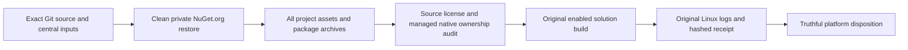

# TestInfrastructure: KL-001 source identity and platform qualification

This is the canonical KL-001 acceptance supplement to
[REQ/AC-TEST-004](../TestInfrastructure.md), with execution under
[ADR-117](../../ADR/ADR-117-native-tunit-ci-entry.md) and distribution licensing
under [ADR-107](../../ADR/ADR-107-elastic-license.md). Status: in progress.

## Scope and decision

Original architecture KL-001 requires SDK/package/source/license identities,
managed/native separation, clean restore/build and explicit unsupported platforms.
The owner-selected Linux-only qualification replaces the original macOS arm64
CI requirement. The no-lockfile policy replaces the design's package-lock wording.
SDK/C# and central package pins remain in global.json, Directory.Build.props and
Directory.Packages.props; this document must not duplicate their version list.
NuGet.Config selects the intended feed. Centrally declared direct and transitive
pins do not freeze every otherwise unpinned transitive archive: the actual resolved
closure and archive hashes must also accompany the source-bound CI receipt.

Actors are the contributor, Linux CI runner and evidence/release owner. Entry
points are the actual solution restore/build and native TUnit selector; no product
endpoint, authorization, storage, provider or topology changes are part of KL-001.
No migration, fallback, local feed or temporary project reference is permitted.

## Whole-task requirement and acceptance map

| Requirement | Acceptance and failure condition | Real evidence or explicit review exception |
|---|---|---|
| REQ-KL001-001: one canonical SDK/C# and direct/transitive pin manifest | AC-KL001-001: clean Linux x64 restore and enabled complete Release solution build succeed at the same delivered Git SHA; selected SDK, central input hashes and all actual project graph hashes are retained. A missing project, floating/direct version override, lockfile or restore/build error fails. | Original GitHub restore/build stdout and exit codes, dotnet --info, solution/project inventory and source-bound receipt. This is an infrastructure operation; getter/property or source-word TUnit tests are N/A. |
| REQ-KL001-002: actual package/source/license identity closure | AC-KL001-002: every resolved package/version has its actual archive SHA256/SHA512, NuGet feed/catalog identity, nuspec/source identity and license expression or immutable license-file identity. Missing data, cache/feed hash mismatch or mutable-only source/license identity fails closed. Declared source commit and independently bound upstream release commit remain distinguished. | Hash the actual clean restored archives; retain package metadata, included license bytes and original upstream release/tag/source witnesses. Review exception: upstream licensing identity is an artifact/primary-source audit, not a functional operation or legal compatibility opinion. |
| REQ-KL001-003: managed/native ownership is explicit | AC-KL001-003: enumerate actual compile/runtime/native/runtimeTargets and packaged native tools from every project graph/archive. Bind selected RID, archive member hashes and product versus AppHost/test/benchmark consumers; include runtime/base-image native requirements separately. No ANN/native or managed-only claim follows from package names. | Original assets/nuspec/archive members and actual image/base-image receipts. Static audit exception; no synthetic platform test or fake native runtime. |
| REQ-KL001-004: explicit supported/unsupported/unqualified platform disposition | AC-KL001-004: the matrix below identifies qualification target and limits, with Linux native/scalar portability execution separately bound to original reports. Missing/non-Linux evidence cannot become Linux qualification; disabled intrinsics in a caller do not prove container server scalar execution. | Actual Linux restore/build and native normal/scalar receipts. Existing meaningful scalar operation cases remain the portability oracle; this task adds no property-only tests. |
| REQ-KL001-005: preserve distribution and dependency license identity | AC-KL001-005: root ELv2 operative body equals authoritative published bytes, ManagedCode remains holder/licensor, and actual newly packed/published distributions include the exact root license. Independent licenses/notices remain unchanged. Missing/different license bytes or open-source/automatic-expiry promises fail. | ADR-107's license and real distribution artifact checks. Whole release readiness remains outside this foundation task; artifact inspection proves packaging only. |

Every row maps original KL-001 work and acceptance without requiring unrelated
full-product endurance to close this infrastructure task. Mandatory final full
unit/recovery/RF3/coverage gates remain mandatory product qualification and are
not replaced by this scoped receipt.

## Platform disposition

| Platform | Current disposition | Evidence boundary |
|---|---|---|
| Linux x64 | Required qualification target; current clean delivered-source KL-001 receipt pending | Actual GitHub runner OS/architecture, clean restore, complete build, package/native audit and original scalar operation receipts required. RF3 servers remain real Linux Docker resources owned by Aspire. |
| Linux arm64 | Unqualified | No current task-wide restore/build/native/runtime receipt; Linux x64 evidence does not qualify arm64. |
| macOS arm64/x64 | Development use only; unqualified for delivered product | Historical local checks are development evidence. Owner removed macOS CI qualification; that decision is not evidence of runtime incompatibility. |
| Windows x64/arm64 | Unqualified | No current task-wide native/runtime qualification. Provider-specific clock/durability/platform boundaries remain explicit in their owning features. |
| Browser/WASM, mobile and other RIDs | Unsupported distribution targets for this initial server qualification scope | No server distribution or topology is qualified for these targets. This does not assert that all individual managed SDK assemblies are intrinsically incompatible. |

No platform is advertised production-ready by KL-001. .NET's
[Ubuntu installation support](https://learn.microsoft.com/en-us/dotnet/core/install/linux-ubuntu-install)
is a framework prerequisite, not KeyLoad qualification. Native system libraries
must come from the actual runner/base-image inventory; managed-first does not
mean the .NET runtime or test infrastructure has no native dependencies.

## Ordered execution and integration contract

1. TASK-KL001-IDENTITY-001: freeze this whole-task map and platform disposition;
   root joins these docs before audit/CI source integration.
2. TASK-KL001-IDENTITY-002: capture one clean delivered-source Linux solution
   restore using an owned empty package directory and unchanged NuGet.Config.
   Preserve the shared cache; retain all project.assets and actual archive hashes,
   direct/central pins, source/license witnesses and native ownership. Do not emit
   packages.lock.json. Upstream package defects follow their owning release policy.
3. TASK-KL001-IDENTITY-003: run the actual enabled complete solution build from
   those same restored inputs, retaining original failure logs. Run relevant
   canonical format/governance/license packaging checks in GitHub. Failures are
   repaired by their actual owners; no suppressions or weakened tests.
4. TASK-KL001-IDENTITY-004: bind relevant existing native scalar operation reports
   and the actual package/publish license artifacts. Authentication, source SHA,
   input/image/DLL/PDB identity, no skip and cleanup remain unchanged. Root owns
   CI and source integration; audit worker owns private immutable witnesses.
5. TASK-KL001-IDENTITY-005: root reviews every AC and promotes only satisfied
   criteria with original source/run/attempt/job/artifact links. A clean restore
   without a passing build cannot close KL-001; a cache snapshot cannot close it.

Negative/error review executes real rejected restore/build/artifact admissions:
missing archive, wrong feed/hash/source, missing license/native member or a failed
build keeps the task open. Restore healthy exact published inputs and rerun the
original operation; do not fabricate passing receipts or introduce consumer shims.
No new runtime behaviour is authored, so code coverage, CRAP, mutation and new
functional test creation are N/A to this documentary/audit stage. Existing relevant
operation checks and mandatory final product qualification remain unchanged.

Rollback removes only this coherent documentation amendment and its evidence
selection; it neither changes packages nor admits previously rejected evidence.
