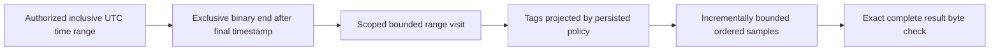
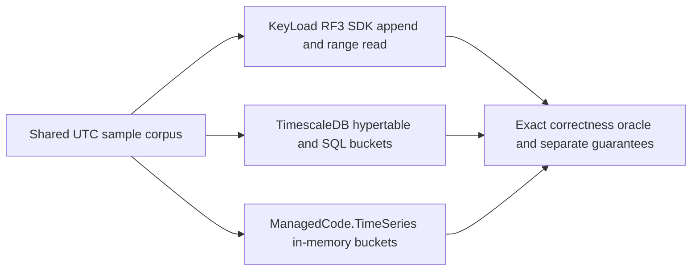
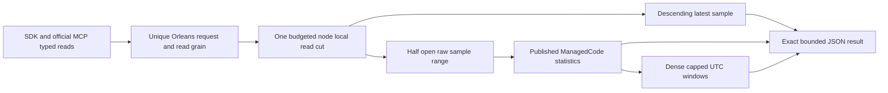

# TimeSeries

Status: bounded inclusive range source present; additive latest/aggregate/window
source joined under ADR-052, with its delivered-SHA CI and remaining gates pending.
[ADR-035](../ADR/ADR-035-memory-performance.md) maps REQ-MP-002 to AC-MP-005/012.

| Requirement | Acceptance | Evidence |
|---|---|---|
| REQ-SERIES-001: stop at the requested timestamp end before decoding later records | AC-MP-005 | Real-store narrow range with large later values, equal timestamps and min/max/offset boundaries |
| REQ-SERIES-002: one work/cancel/deadline and complete response budget | AC-MP-005 | Small raw/result budget failures, exact serialized boundary and cancellation with a healthy following operation |
| REQ-SERIES-003: retain UTC/sequence ordering, dedup and tag projection | AC-MP-005/012 | Existing real append/dedup tests plus persisted-policy range cases |

The existing operation includes both `from` and `until` timestamps; the repair
preserves that behavior. Equal timestamps remain ordered by persisted sequence.
ReadSamplesRequest's end description must reflect the actual inclusive contract.
Schema, append, retention, rollups, public JSON and SDK shapes are unchanged.
UI: N/A. New helpers and tests mirror Features/TimeSeries/. The lead owns shared
budget/clock, the existing GraphAndSeries.cs ReadSamples region, and endpoint
cancellation forwarding. This serializes the mixed legacy file under ADR-032.

Tests use real ZoneTree state and TUnit/MTP. Release/static development checks are
distinct from GitHub unit/recovery/RF3 SDK qualification and measured performance.

## Повний контракт часових рядів

Актори: producer samples, authorized range reader і майбутній retention/rollup worker. Current API: `AppendSamples`/`SampleData` у [contracts](../../src/KeyLoad.Abstractions/Contracts.cs), `ReadSamplesAsync` у [SDK](../../src/KeyLoad.Client/KeyLoadClient.cs); source [GraphAndSeries](../../src/KeyLoad.Core/GraphAndSeries.cs). Canonical identity: partition + resource/set + series; timestamps normalized to UTC та sequence визначає порядок equal timestamps.

| Вимога | Acceptance / positive, negative, edge, error | Test mapping |
|---|---|---|
| REQ-SERIES-004: append зберігає stable sample identity і finite numeric values | AC-SERIES-004: out-of-order input читається за UTC/sequence; same EventId/fingerprint не дублюється; changed content дає Conflict; nonfinite value відхиляється без partial batch | Existing `OutOfOrderSamplesStayOrderedAndSampleIdIsIdempotent`, `LargeFiniteVectorsAndSampleValuesRemainValidAndSimilarityDoesNotOverflow` у [GraphAndSearchTests](../../tests/KeyLoad.UnitTests/GraphAndSearchTests.cs); explicit mismatch/error expansion PLANNED |
| REQ-SERIES-005: ordered inclusive ranges зберігають authorisation і повну response межу | AC-SERIES-005: equal/min/max timestamps, empty range, limit і exact byte boundary дають визначений результат; unauthorized tags omit/deny за policy; exhausted/cancelled read не змінює data та не псує наступний read | Existing [TimeSeriesReadResourceTests](../../tests/KeyLoad.UnitTests/Features/TimeSeries/TimeSeriesReadResourceTests.cs); REQ-SERIES-001–003 та AC-MP-005/012 не замінюються |
| REQ-SERIES-006: retention, aggregates, rollups та compressed chunks мають окремі qualified contracts | AC-SERIES-006: PLANNED real-store tests доводять declared aggregation windows/late data/dedup, expiry/rebuild/recovery і bounds; raw oracle збігається з chunked representation; incompatible encoding відхиляється | PLANNED unit/recovery/resource suites для KL-025/026/078; реалізація цих extended capabilities не доведена |

Source-present baseline: sample append/order/dedup і inclusive bounded read. Planned: автоматична retention, rollups, chunk compression qualification та distributed series execution. Existing inclusive read repair keeps its wire shape; the additive aggregate/latest contract below is governed by ADR-052 and has separate pending source/qualification evidence.

Рішення: [ADR-005 keyspace](../ADR/ADR-005-canonical-keyspace-codec.md), [ADR-010 bounds/security](../ADR/ADR-010-query-budgets-security.md), [ADR-016 atomic/physical boundary](../ADR/ADR-016-atomic-physical-placement.md), [ADR-011 upgrades](../ADR/ADR-011-format-upgrades.md), [ADR-030 retention/restore](../ADR/ADR-030-retention-paused-restore.md). Shared codec/storage/replication integration — один lead; feature helpers та matching tests `Features/TimeSeries/`. Frontend N/A. Product tests — real TUnit, process recovery, Docker/Aspire SDK/MCP у GitHub; runtime evidence для спільного source pending.

## ManagedCode.TimeSeries and Timescale comparison

REQ-SERIES-007 / AC-SERIES-007 map to REQ-BC-026 and AC-TSC-001..006 under
[ADR-050](../ADR/ADR-050-timeseries-timescale-comparison.md) and the
[time-series comparison acceptance](../../timeseries-comparison.acceptance.md).
The profile exercises KeyLoad's existing persisted RF3 sample API, a real
TimescaleDB hypertable, and the published `ManagedCode.TimeSeries` 10.0.0 library
for in-memory bucket aggregation at the original baseline. The current central
pin is published10.0.3 after the owning temporal and summer-allocation repairs;
its [delivery receipt](../implementation/timeseries-dependency-10.0.3.json)
verifies1107/1107 tests, module coverage, release/tag and actual signed NuGet
content before consumption. Four16-case native normal/scalar profiles qualify
the owning allocation change; they do not measure KeyLoad database throughput. REQ-SERIES-007/009/010/011 and AC-SERIES-007/009/010/011 retain their
existing real comparison and raw/window/date-edge/budget/security regression
oracles. Their new consumer-SHA GitHub execution is pending. The library is not
KeyLoad's persistence layer.
Reports keep persistence, recovery, replication, and acknowledgement guarantees
distinct; the public API and existing nine-engine matrix remain unchanged. The
comparison implementation and TUnit cases compile in the full Release solution.
Container execution, test results, and exact-SHA comparison artifacts remain
pending GitHub Actions qualification.

## Bounded latest, raw aggregates and dense windows

[ADR-052](../ADR/ADR-052-timeseries-bounded-aggregates.md) is Accepted before
implementation. It freezes exact DTOs, boundary/overflow/budget/security rules,
dependencies, ordered task graph, disjoint ownership and rollback. Working
acceptance/plan are timeseries-aggregates.acceptance.md and its plan; durable
normative contract remains the ADR and this Feature. The comparison baseline's
existing API statement above describes ADR-050; it does not erase these additive
product APIs or relabel caller-folded benchmark statistics as server measurements.

| Requirement | Measurable acceptance | Automated mapping / TASK |
|---|---|---|
| REQ-SERIES-008: bounded latest at the current committed cut | AC-SERIES-008: descending UTC/sequence identity, inclusive optional cut, absence/min/max/offset/ties, one matching committed baseline entry independent of history | SampleLatestTests; TimeSeries SDK/MCP parity; TASK-SERIES-CORE-W8/RF3-W8 |
| REQ-SERIES-009: complete raw half-open aggregate using published native library | AC-SERIES-009: count/sum/min/max/raw average match independent reference for late/dedup/negative/empty/offset/date edges; null end includes MaxValue; finite overflow rejects safely | SampleAggregateTests and RF3 SDK/MCP oracle; TASK-SERIES-CORE-W8/RF3-W8 |
| REQ-SERIES-010: bounded dense UTC windows | AC-SERIES-010: anchor From, positive fixed Width, empty windows, final clamping, raw weighted average, date-edge arithmetic and caller/server window cap checked before allocation | SampleAggregateWindowTests and SDK/MCP windows; TASK-SERIES-CORE-W8/RF3-W8 |
| REQ-SERIES-011: one complete operation/security budget | AC-SERIES-011: positive caller caps, charged sample lookahead fails the whole aggregate, metadata/raw/exact result bytes/deadline/cancel share one view; current SeriesRead, projected latest tags and revocation; failures preserve data and healthy next reads | SampleAggregateBudgetTests, SampleAggregateAuthorizationTests and real RF3 persisted-authority cases; TASK-SERIES-CORE-W8/RF3-W8 |
| REQ-SERIES-012: typed public operations preserve real RF3 request isolation | AC-SERIES-012: .NET/HTTP/official MCP same results/errors/discovery schemas; old enum values preserved; genuine follower kill/restart retains results across all live replicas | TimeSeries RF3 integration, typed round trips and official MCP discovery; TASK-SERIES-SURFACE-R8/RF3-W8 |

Slice map: Abstractions/Features/TimeSeries read/result DTOs;
Core/Features/TimeSeries private readers/native accumulator and public static
TimeSeriesReadOperations facade; Client/Features/TimeSeries typed SDK;
Server/Features/TimeSeries HTTP routes. Shared ClusterRouting read-kind/dispatch,
ClientApi MCP catalog and ResourceExecution budget forwarding have one root
integration owner. StorageRecovery owns shared reverse range traversal under
REQ-STORAGE-013. Tests mirror TimeSeries in existing TUnit/MTP projects. Frontend
N/A: these typed database reads add no dedicated page. Persistence migration
N/A: the canonical sample keys/records/commits are unchanged.

Qualification uses independent raw-reference expected outputs and actual
ZoneTree/persisted policies in unit cases, plus genuine three-container .NET and
official MCP clients and isolated restart scenarios. No local tests/doubles or
claims based on source presence. Full same-SHA unit/recovery/RF3 suites and
configured quality gates are required. Numeric coverage/advanced retention,
rollups/SQL/compression/endurance/performance evidence remains open. ADR-052
remains Accepted, not Implemented, until its full implementation contract passes.

AC-SERIES-011 ingress proof: TimeSeriesHttpAdmissionTests competes each new
canonical route with an existing heavy query using the real shared admission
governor, checks rejection leaves the reservation unchanged and confirms healthy
admission after release. HttpAdmissionGovernor is a serialized root join; HTTP
and MCP route classification share the existing working-set ceilings.

R9 native failure loop preserves ADR052's public contracts. Cancelled d186
run37056851814 nevertheless retains terminal Linux/macOS unit868/870 and RF343/46
reports; those partial failures are not complete qualification. The valid raw-fold
fixture must use distinct IDs when content changes, while the new
SampleAggregateIdempotencyTests separately proves Conflict leaves canonical
samples unchanged and a following legitimate append/aggregate succeeds. The
complete catalog remains exactly53 tools with all prior50 and three additive
TimeSeries schemas/routes/hints, including the same ten blob operations. All three
SDK pre-cancelled reads use the existing shared transport's failed Result/Cancelled
problem; native official MCP cancellation keeps its existing exception semantics.
These are source-oracle corrections, not altered production dedup/transport rules.
REQ-SERIES009/011/012 and AC-QUAL004 trace to those existing/new real tests;
the exact corrected-source full GitHub suites and coverage remain mandatory.
