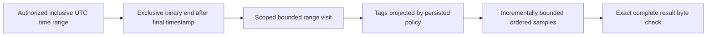
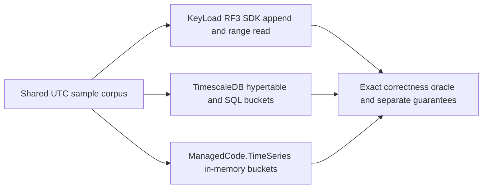

# TimeSeries

Status: bounded range repair accepted; implementation/CI pending.
[ADR-035](../ADR/ADR-035-memory-performance.md) maps REQ-MP-002 to AC-MP-005/012.

| Requirement | Acceptance | Evidence |
|---|---|---|
| REQ-SERIES-001: stop at the requested timestamp end before decoding later records | AC-MP-005 | Real-store narrow range with large later values, equal timestamps and min/max/offset boundaries |
| REQ-SERIES-002: one work/cancel/deadline and complete response budget | AC-MP-005 | Small raw/result budget failures, exact serialized boundary and cancellation with a healthy following operation |
| REQ-SERIES-003: retain UTC/sequence ordering, dedup and tag projection | AC-MP-005/012 | Existing real append/dedup tests plus persisted-policy range cases |

The existing operation includes both `from` and `until` timestamps; the repair
preserves that behavior. Equal timestamps remain ordered by persisted sequence.
ReadSamplesRequest's end description must reflect the actual inclusive contract.
Schema, append, retention, rollups, public JSON and SDK shapes are unchanged.
UI: N/A. New helpers and tests mirror Features/TimeSeries/. The lead owns shared
budget/clock, the existing GraphAndSeries.cs ReadSamples region, and endpoint
cancellation forwarding. This serializes the mixed legacy file under ADR-032.

Tests use real ZoneTree state and TUnit/MTP. Release/static development checks are
distinct from GitHub unit/recovery/RF3 SDK qualification and measured performance.

## Повний контракт часових рядів

Актори: producer samples, authorized range reader і майбутній retention/rollup worker. Current API: `AppendSamples`/`SampleData` у [contracts](../../src/KeyLoad.Abstractions/Contracts.cs), `ReadSamplesAsync` у [SDK](../../src/KeyLoad.Client/KeyLoadClient.cs); source [GraphAndSeries](../../src/KeyLoad.Core/GraphAndSeries.cs). Canonical identity: partition + resource/set + series; timestamps normalized to UTC та sequence визначає порядок equal timestamps.

| Вимога | Acceptance / positive, negative, edge, error | Test mapping |
|---|---|---|
| REQ-SERIES-004: append зберігає stable sample identity і finite numeric values | AC-SERIES-004: out-of-order input читається за UTC/sequence; same EventId/fingerprint не дублюється; changed content дає Conflict; nonfinite value відхиляється без partial batch | Existing `OutOfOrderSamplesStayOrderedAndSampleIdIsIdempotent`, `LargeFiniteVectorsAndSampleValuesRemainValidAndSimilarityDoesNotOverflow` у [GraphAndSearchTests](../../tests/KeyLoad.UnitTests/GraphAndSearchTests.cs); explicit mismatch/error expansion PLANNED |
| REQ-SERIES-005: ordered inclusive ranges зберігають authorisation і повну response межу | AC-SERIES-005: equal/min/max timestamps, empty range, limit і exact byte boundary дають визначений результат; unauthorized tags omit/deny за policy; exhausted/cancelled read не змінює data та не псує наступний read | Existing [TimeSeriesReadResourceTests](../../tests/KeyLoad.UnitTests/Features/TimeSeries/TimeSeriesReadResourceTests.cs); REQ-SERIES-001–003 та AC-MP-005/012 не замінюються |
| REQ-SERIES-006: retention, aggregates, rollups та compressed chunks мають окремі qualified contracts | AC-SERIES-006: PLANNED real-store tests доводять declared aggregation windows/late data/dedup, expiry/rebuild/recovery і bounds; raw oracle збігається з chunked representation; incompatible encoding відхиляється | PLANNED unit/recovery/resource suites для KL-025/026/078; реалізація цих extended capabilities не доведена |

Source-present: sample append/order/dedup і inclusive bounded read. Planned: автоматична retention, rollups/aggregates, chunk compression qualification та distributed series execution. API wire shape і target read repair лишаються такими, як описано вище; цей документ не вводить нові aggregate endpoints.

Рішення: [ADR-005 keyspace](../ADR/ADR-005-canonical-keyspace-codec.md), [ADR-010 bounds/security](../ADR/ADR-010-query-budgets-security.md), [ADR-016 atomic/physical boundary](../ADR/ADR-016-atomic-physical-placement.md), [ADR-011 upgrades](../ADR/ADR-011-format-upgrades.md), [ADR-030 retention/restore](../ADR/ADR-030-retention-paused-restore.md). Shared codec/storage/replication integration — один lead; feature helpers та matching tests `Features/TimeSeries/`. Frontend N/A. Product tests — real TUnit, process recovery, Docker/Aspire SDK/MCP у GitHub; runtime evidence для спільного source pending.

## ManagedCode.TimeSeries and Timescale comparison

REQ-SERIES-007 / AC-SERIES-007 map to REQ-BC-026 and AC-TSC-001..006 under
[ADR-050](../ADR/ADR-050-timeseries-timescale-comparison.md) and the
[time-series comparison acceptance](../../timeseries-comparison.acceptance.md).
The profile exercises KeyLoad's existing persisted RF3 sample API, a real
TimescaleDB hypertable, and the published `ManagedCode.TimeSeries` 10.0.0 library
for in-memory bucket aggregation. The library is not KeyLoad's persistence layer.
Reports keep persistence, recovery, replication, and acknowledgement guarantees
distinct; the public API and existing nine-engine matrix remain unchanged. The
comparison implementation and TUnit cases compile in the full Release solution.
Container execution, test results, and exact-SHA comparison artifacts remain
pending GitHub Actions qualification.

