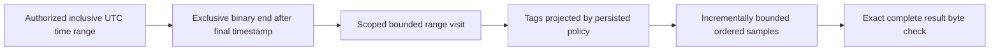
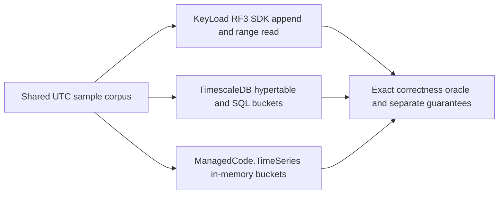
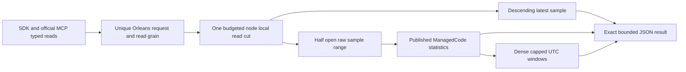
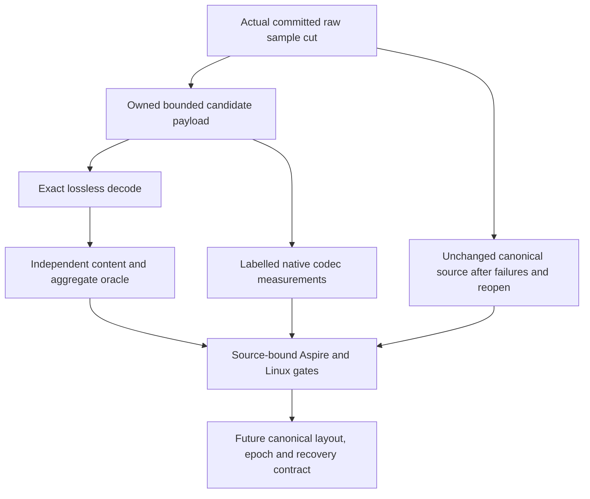

# TimeSeries

## Logged expiry stage of the 104-task completion

The owner directs completion of all KL tasks, with implementation before broad
stabilization. [ADR-073](../ADR/ADR-073-logged-series-retention.md) accepts the
following concrete KL-026 stage. Its predecessor requirements remain mandatory.

| Requirement | Measurable acceptance | Tests and owner |
|---|---|---|
| REQ-SERIES-013: logged monotone retention is atomic and bounded | AC-SERIES-013: only SeriesManage may submit expiry; future/backwards/invalid-page cutoffs reject without changing samples/floor; one command advances the floor and deletes <= MaximumDeletes; same-cutoff continuation and command replay preserve exact cumulative counts | SampleRetentionMutationTests, real ZoneTree; root joins RF3 SDK/MCP |
| REQ-SERIES-014: every series reader obeys the same exclusive floor | AC-SERIES-014: with physically retained older records, inclusive range, latest, half-open raw aggregates and dense windows return only timestamps >= Before; equal timestamp remains visible; Min/Max/offset/empty/request-before-floor cases preserve prior boundaries and dense anchors | SampleRetentionReadTests, all four actual APIs |
| REQ-SERIES-015: late data cannot resurrect expired history | AC-SERIES-015: a new ID below Before rejects the entire mixed batch; a retained identical ID deduplicates without adding a record; changed content conflicts; equal/newer samples succeed; sample sequence and ID receipts survive purge/reopen | SampleRetentionAppendTests and actual-file reopen; root joins process recovery |
| REQ-SERIES-016: native lifetime and failure contracts remain explicit | AC-SERIES-016: unknown/corrupt retention state fails closed, shared raw/result/deadline/cancel bounds hold, expiry waits for an actual read gate and leaves the following read healthy, reopen preserves floor/counts; no bucket/handle moves or ID-receipt deletion | SampleRetentionLifecycleTests, real storage gate; root recovery/RF3/format inventory |

Execution graph: TASK-104-SERIES-CONTRACT (root, shared contracts/docs, complete
before delegation) -> TASK-104-SERIES-EXPIRY (Luna/high, disjoint Core TimeSeries
and new tests) -> TASK-104-SERIES-JOIN (root, transport/recovery/Aspire RF3,
build/format/governance/GitHub evidence). Shared engine dispatch/config/docs have
one root owner. Agent completion means reviewed assigned source and authored tests;
parent KL-026 remains open until all expiry, rollup and qualification criteria pass.
Full prior suite baseline is the retained current-source qualification in status;
new unexecuted cases are not passing evidence. No new dependency or UI applies.

Status: bounded inclusive range source present; additive latest/aggregate/window
source joined under ADR-052, with its delivered-SHA CI and remaining gates pending.
[ADR-035](../ADR/ADR-035-memory-performance.md) maps REQ-MP-002 to AC-MP-005/012.

| Requirement | Acceptance | Evidence |
|---|---|---|
| REQ-SERIES-001: stop at the requested timestamp end before decoding later records | AC-MP-005 | Real-store narrow range with large later values, equal timestamps and min/max/offset boundaries |
| REQ-SERIES-002: one work/cancel/deadline and complete response budget | AC-MP-005 | Small raw/result budget failures, exact serialized boundary and cancellation with a healthy following operation |
| REQ-SERIES-003: retain UTC/sequence ordering, dedup and tag projection | AC-MP-005/012 | Existing real append/dedup tests plus persisted-policy range cases |

The existing operation includes both `from` and `until` timestamps; the repair
preserves that behavior. Equal timestamps remain ordered by persisted sequence.
ReadSamplesRequest's end description must reflect the actual inclusive contract.
Schema, append, retention, rollups, public JSON and SDK shapes are unchanged.
UI: N/A. New helpers and tests mirror Features/TimeSeries/. The lead owns shared
budget/clock, the existing GraphAndSeries.cs ReadSamples region, and endpoint
cancellation forwarding. This serializes the mixed legacy file under ADR-032.

Tests use real ZoneTree state and TUnit/MTP. Release/static development checks are
distinct from GitHub unit/recovery/RF3 SDK qualification and measured performance.

## Повний контракт часових рядів

Актори: producer samples, authorized range reader і майбутній retention/rollup worker. Current API: `AppendSamples`/`SampleData` у [contracts](../../src/KeyLoad.Abstractions/Contracts.cs), `ReadSamplesAsync` у [SDK](../../src/KeyLoad.Client/KeyLoadClient.cs); source [GraphAndSeries](../../src/KeyLoad.Core/GraphAndSeries.cs). Canonical identity: partition + resource/set + series; timestamps normalized to UTC та sequence визначає порядок equal timestamps.

| Вимога | Acceptance / positive, negative, edge, error | Test mapping |
|---|---|---|
| REQ-SERIES-004: append зберігає stable sample identity і finite numeric values | AC-SERIES-004: out-of-order input читається за UTC/sequence; same EventId/fingerprint не дублюється; changed content дає Conflict; nonfinite value відхиляється без partial batch | Existing `OutOfOrderSamplesStayOrderedAndSampleIdIsIdempotent`, `LargeFiniteVectorsAndSampleValuesRemainValidAndSimilarityDoesNotOverflow` у [GraphAndSearchTests](../../tests/KeyLoad.UnitTests/GraphAndSearchTests.cs); explicit mismatch/error expansion PLANNED |
| REQ-SERIES-005: ordered inclusive ranges зберігають authorisation і повну response межу | AC-SERIES-005: equal/min/max timestamps, empty range, limit і exact byte boundary дають визначений результат; unauthorized tags omit/deny за policy; exhausted/cancelled read не змінює data та не псує наступний read | Existing [TimeSeriesReadResourceTests](../../tests/KeyLoad.UnitTests/Features/TimeSeries/Cases/TimeSeriesReadResourceTests.cs); REQ-SERIES-001–003 та AC-MP-005/012 не замінюються |
| REQ-SERIES-006: retention, aggregates, rollups та compressed chunks мають окремі qualified contracts | AC-SERIES-006: PLANNED real-store tests доводять declared aggregation windows/late data/dedup, expiry/rebuild/recovery і bounds; raw oracle збігається з chunked representation; incompatible encoding відхиляється | PLANNED unit/recovery/resource suites для KL-025/026/078; ADR-079 adds the bounded codec stage below without closing canonical chunk/recovery acceptance |

Source-present baseline: sample append/order/dedup і inclusive bounded read. Planned: автоматична retention, rollups, chunk compression qualification та distributed series execution. Existing inclusive read repair keeps its wire shape; the additive aggregate/latest contract below is governed by ADR-052 and has separate pending source/qualification evidence.

Рішення: [ADR-005 keyspace](../ADR/ADR-005-canonical-keyspace-codec.md), [ADR-010 bounds/security](../ADR/ADR-010-query-budgets-security.md), [ADR-016 atomic/physical boundary](../ADR/ADR-016-atomic-physical-placement.md), [ADR-011 current native format](../ADR/ADR-011-current-native-format.md), [ADR-116 first-release format policy](../ADR/ADR-116-first-release-current-format.md), [ADR-030 retention/restore](../ADR/ADR-030-retention-paused-restore.md). Shared codec/storage/replication integration — один lead; feature helpers та matching tests `Features/TimeSeries/`. Frontend N/A. Product tests — real TUnit, process recovery, Docker/Aspire SDK/MCP у GitHub; runtime evidence для спільного source pending.

## ManagedCode.TimeSeries and Timescale comparison

REQ-SERIES-007 / AC-SERIES-007 map to REQ-BC-026 and AC-TSC-001..006 under
[ADR-050](../ADR/ADR-050-timeseries-timescale-comparison.md) and the
[time-series comparison acceptance](../ADR/ADR-050-timeseries-timescale-comparison.md).
The profile exercises KeyLoad's existing persisted RF3 sample API, a real
TimescaleDB hypertable, and the published `ManagedCode.TimeSeries` 10.0.0 library
for in-memory bucket aggregation at the original baseline. The current central
pin is published10.0.3 after the owning temporal and summer-allocation repairs;
its delivery receipt (report removed from repository)
verifies1107/1107 tests, module coverage, release/tag and actual signed NuGet
content before consumption. Four16-case native normal/scalar profiles qualify
the owning allocation change; they do not measure KeyLoad database throughput. REQ-SERIES-007/009/010/011 and AC-SERIES-007/009/010/011 retain their
existing real comparison and raw/window/date-edge/budget/security regression
oracles. Their new consumer-SHA GitHub execution is pending. The library is not
KeyLoad's persistence layer.
Reports keep persistence, recovery, replication, and acknowledgement guarantees
distinct; the public API and existing nine-engine matrix remain unchanged. The
comparison implementation and TUnit cases compile in the full Release solution.
Container execution, test results, and exact-SHA comparison artifacts remain
pending GitHub Actions qualification.

## Bounded latest, raw aggregates and dense windows

[ADR-052](../ADR/ADR-052-timeseries-bounded-aggregates.md) is Accepted before
implementation. It freezes exact DTOs, boundary/overflow/budget/security rules,
dependencies, ordered task graph, disjoint ownership and rollback. Acceptance
and execution criteria live in this Feature and the ADR; the durable
normative contract remains the ADR and this Feature. The comparison baseline's
existing API statement above describes ADR-050; it does not erase these additive
product APIs or relabel caller-folded benchmark statistics as server measurements.

| Requirement | Measurable acceptance | Automated mapping / TASK |
|---|---|---|
| REQ-SERIES-008: bounded latest at the current committed cut | AC-SERIES-008: descending UTC/sequence identity, inclusive optional cut, absence/min/max/offset/ties, one matching committed baseline entry independent of history | SampleLatestTests; TimeSeries SDK/MCP parity; TASK-SERIES-CORE-W8/RF3-W8 |
| REQ-SERIES-009: complete raw half-open aggregate using published native library | AC-SERIES-009: count/sum/min/max/raw average match independent reference for late/dedup/negative/empty/offset/date edges; null end includes MaxValue; finite overflow rejects safely | SampleAggregateTests and RF3 SDK/MCP oracle; TASK-SERIES-CORE-W8/RF3-W8 |
| REQ-SERIES-010: bounded dense UTC windows | AC-SERIES-010: anchor From, positive fixed Width, empty windows, final clamping, raw weighted average, date-edge arithmetic and caller/server window cap checked before allocation | SampleAggregateWindowTests and SDK/MCP windows; TASK-SERIES-CORE-W8/RF3-W8 |
| REQ-SERIES-011: one complete operation/security budget | AC-SERIES-011: positive caller caps, charged sample lookahead fails the whole aggregate, metadata/raw/exact result bytes/deadline/cancel share one view; current SeriesRead, projected latest tags and revocation; failures preserve data and healthy next reads | SampleAggregateBudgetTests, SampleAggregateAuthorizationTests and real RF3 persisted-authority cases; TASK-SERIES-CORE-W8/RF3-W8 |
| REQ-SERIES-012: typed public operations preserve real RF3 request isolation | AC-SERIES-012: .NET/HTTP/official MCP same results/errors/discovery schemas; old enum values preserved; genuine follower kill/restart retains results across all live replicas | TimeSeries RF3 integration, typed round trips and official MCP discovery; TASK-SERIES-SURFACE-R8/RF3-W8 |

Slice map: Abstractions/Features/TimeSeries read/result DTOs;
Core/Features/TimeSeries private readers/native accumulator and public static
TimeSeriesReadOperations facade; Client/Features/TimeSeries typed SDK;
Server/Features/TimeSeries HTTP routes. Shared ClusterRouting read-kind/dispatch,
ClientApi MCP catalog and ResourceExecution budget forwarding have one root
integration owner. StorageRecovery owns shared reverse range traversal under
REQ-STORAGE-013. Tests mirror TimeSeries in existing TUnit/MTP projects. Frontend
N/A: these typed database reads add no dedicated page. No conversion or backfill
of another sample format is supported; current sample keys/records/commits remain
unchanged under [CurrentFormat](StorageRecovery/CurrentFormat.md) and [ADR-116](../ADR/ADR-116-first-release-current-format.md).

Qualification uses independent raw-reference expected outputs and actual
ZoneTree/persisted policies in unit cases, plus genuine three-container .NET and
official MCP clients and isolated restart scenarios. No local tests/doubles or
claims based on source presence. Full same-SHA unit/recovery/RF3 suites and
configured quality gates are required. Numeric coverage/advanced retention,
rollups/SQL/compression/endurance/performance evidence remains open. ADR-052
remains Accepted, not Implemented, until its full implementation contract passes.

AC-SERIES-011 ingress proof: TimeSeriesHttpAdmissionTests competes each new
canonical route with an existing heavy query using the real shared admission
governor, checks rejection leaves the reservation unchanged and confirms healthy
admission after release. HttpAdmissionGovernor is a serialized root join; HTTP
and MCP route classification share the existing working-set ceilings.

R9 native failure loop preserves ADR052's public contracts. Cancelled d186
run37056851814 nevertheless retains terminal Linux/macOS unit868/870 and RF343/46
reports; those partial failures are not complete qualification. The valid raw-fold
fixture must use distinct IDs when content changes, while the new
SampleAggregateIdempotencyTests separately proves Conflict leaves canonical
samples unchanged and a following legitimate append/aggregate succeeds. The
earlier TimeSeries stage exercised53 tools. The current catalog has56 tools,
including aggregate replay and retention, with independently checked schemas,
routes/hints and the same ten blob operations. All three
SDK pre-cancelled reads use the existing shared transport's failed Result/Cancelled
problem; native official MCP cancellation keeps its existing exception semantics.
These are source-oracle corrections, not altered production dedup/transport rules.
REQ-SERIES009/011/012 and AC-QUAL004 trace to those existing/new real tests;
the exact corrected-source full GitHub suites and coverage remain mandatory.

## Lossless chunk codec qualification — ADR-079

[ADR-079](../ADR/ADR-079-lossless-series-chunk-codecs.md) freezes a private,
bounded generated-Orleans codec candidate before canonical storage integration.
Current per-sample ZoneTree rows, ID receipts, sequences, retention floors and
identity epoch7 remains unchanged. No conversion or rewrite of an earlier canonical
sample representation is supported. Codec qualification does not close KL-078:
correction generations and process/RF3 recovery still need their separate
current-format contract and original evidence.

The historical report (removed from repository)
records full Aspire normal/scalar2852/2852 verification and36 matched ordinary
BenchmarkDotNet cases with exact source/runtime/corpus binding. Canonical samples
still use their existing per-record ZoneTree representation. The measured controls
cover1/32/256 samples per batch; full database scale, current-format integration,
correction recovery, RF3 and exact-source Linux qualification remain required for
KL-078. No old-record conversion or canonical storage rewrite is supported.

| Requirement | Acceptance criterion | Planned automated evidence |
|---|---|---|
| REQ-SERIES-017: codec preserves exact ordered sample identity/content | AC-CHUNK-001: fixed and seeded 1..256-record roundtrips preserve SeriesId, EventId, exact TagsJson, local/UTC ticks, offset, sequence and IEEE bits; equal UTC ties and late sequence decreases preserve strict UTC/sequence order | SampleChunkCodec* TUnit, independent input/raw oracle including -0, subnormal, finite extremes, date edges and original offsets |
| REQ-SERIES-017: lossless text and aggregates preserve raw meaning | AC-CHUNK-002: valid Unicode and unpaired UTF16 code units survive without replacement; raw fold count/sum/min/max and all four real series-reader results remain unchanged by encoding/decoding; duplicate ID/content remains one canonical sample and changed content conflicts | SampleChunkCodec* and SampleChunkStore* real ZoneTree cases; no reassociated sums or tolerance |
| REQ-SERIES-018: counts, memory, work and failure are bounded | AC-CHUNK-003: 256 succeeds,257/empty reject as frozen; exact envelope admission/oversize and shared byte/deadline/cancellation cases fail whole before unsafe allocation; following real read succeeds and source bytes/cut/ID/sequence/floor remain unchanged | SampleChunkWire* and SampleChunkStore* real cuts, small/exact budgets, cancellation and actual reopen |
| REQ-SERIES-019: generated native format has explicit integrity and compatibility | AC-CHUNK-004: permanent chunk alias/Ids/native golden remain stable; checksum, truncated/trailing native/columns, nonminimal varints, invalid offset/timestamp/sequence/order/value/text dictionary/shape reject as Corruption; unknown versions are FormatUnsupported | SampleChunkWire* structural and independent malformed fixtures |
| REQ-SERIES-019: candidate cannot become a competing authority | AC-CHUNK-005: encoding at one actual authorized source cut writes no keys/files/journals, preserves the current SampleRecord contract and exact data after failure/reopen; private buffers release to the caller and no borrowed view escapes | SampleChunkStore* plus source review; storage/replica/public operation format changes forbidden in this stage |
| REQ-SERIES-020: qualification and performance claims have actual provenance | AC-CHUNK-006: full build/formatter/governance and Aspire TUnit normal/scalar results are source-bound; labelled BenchmarkDotNet controls retain corpus/machine/source/bytes/sample/encode/decode allocations and cost; current-format integration/recovery and acceleration remain explicitly pending | TASK-CHUNK-MEASURE/JOIN; genuine Linux CI and original artifacts required for global qualification |

Canonical slice map: Core `Features/TimeSeries/SampleChunk*`; TUnit
UnitTests `Features/TimeSeries/SampleChunk*`. Benchmark measurement is owned by
the shared [BenchmarkComparisons](BenchmarkComparisons.md) feature in
`benchmarks/KeyLoad.BenchmarkScenarios/Features/BenchmarkComparisons/` and uses
the existing KeyLoad.Benchmarks executable. Frontend, SDK/MCP/HTTP and
Orleans request surfaces are N/A for this transient private codec: their public
contracts are unchanged. StorageRecovery, CrashHost, RecoveryTests and RF3 chunk
integration are N/A for this transient codec candidate because no canonical chunk
is written; ordinary current-format integration and recovery remain mandatory
KL-078 work, not waived acceptance criteria. No legacy-record conversion is
supported.

## RF3 retention oracle correction (2026-10-04)

TASK-SERIES-RF3-ORACLE-JOIN preserves REQ-SERIES-013/016 and AC-SERIES-013/016 under ADR-073. Original Linux run37163610260 at f7e394f68e2971cab4bb0d9306fc7696e8211645 executed84 RF3 cases:82 passed and2 failed. The read-only principal's SDK assertion incorrectly indexed a nonexistent Problem extension instead of its canonical typed ErrorCode, so its subsequent MCP/progress checks were not reached. The follower-stop workflow received a permitted UnknownWriteOutcome but failed before reconciling its same command ID. Root corrects the typed denial oracle and reuses the existing bounded election retry with one captured command, then explicitly replays that command and checks identical commit token and exact cumulative retention progress. No authorization, acknowledgement, cancellation deadline or accepted error is weakened. New runtime qualification remains pending until original actual Aspire RF3 results pass.

Original KL-024 task acceptance is complete on the source-bound Linux Stage VII
cohort documented in [the canonical task status](../implementation/status.json).
Out-of-order and equal-timestamp samples read in defined order; retry does not change sample count. The receipt retains all original full-suite failures;
this task closure does not mark the complete feature or later source qualified.

Original KL-025 range/aggregate task acceptance is complete on the historical source-bound Linux cohort in [the canonical KL-025 task status](../implementation/status.json). Independent raw folds, dense windows, UTC/empty/late boundaries and charged scan caps passed both modes. Original full-suite failures remain retained; complete TimeSeries and current-source qualification are separate.

## TASK-KL026-BOUNDED-ROLLUP-001 — persisted explicit buckets

This bounded stage implements the missing original KL-026 sum/count/min/max bucket and explicit correction path. It does not close KL-026 or supply an automatic retention scheduler, chunk/sketch encoding, performance or RF3 qualification. Original REQ-SERIES-006 and AC-SERIES-006 remain mandatory. ADR-120 is Accepted before implementation.

| Requirement | Exact acceptance and whole-operation tests |
|---|---|
| REQ-SERIES-021: bounded canonical persisted bucket | AC-SERIES-021: explicit nonempty half-open UTC [From,UntilExclusive) bucket, UTC-equivalent offsets share one key; no floor-rounding or tick addition/overflow; native published ManagedCode.TimeSeries accumulator folds ordered raw UTC/sequence values into persisted finite sum/count/min/max and raw sequence/retention watermark; average is reconstructed by the same owned accumulator from sum/count; empty uses zero/null. SampleRollupWholeFlowTests and real SDK/MCP/SQL parity. |
| REQ-SERIES-022: revision, late correction, retention and lifecycle | AC-SERIES-022: ExpectedRevision0 creates; negative or long.MaxValue revisions reject Validation before increment, avoiding overflow; exact current revision corrects after any raw-sequence or exclusive-retention-floor change; stale snapshot read fails HistoryUnavailable until correction; From below floor rejects, equal floor allowed. Drop creates a monotone revision tombstone with no retained statistics, read returns that revision plus absent bucket, and recreate requires tombstone revision (no ABA). Matching original stable command replay returns the exact original receipt without new effects. Native reopen preserves stats/revision/watermark/tombstone; actual store read leases precede commit publication. |
| REQ-SERIES-023: authority and complete bounds | AC-SERIES-023: refresh requires current SeriesManage and SeriesRead; drop current SeriesManage; read current SeriesRead at the same node-local scoped cut. MaxSamples must be positive and <=existing MaxScanRecords; charged overflow lookahead fails the complete atomic batch. Selected state/watermark/raw reads obey existing MaxQueryReadBytes, generated native final frame/outcome limits, and centrally typed MaximumRollupBuckets bounds lifetime bucket identities including tombstones. Nonfinite aggregate/unknown or corrupt typed state fails closed. Read shares original token/deadline/raw/result budget; failed read changes no bytes/position and healthy follow-up succeeds. Replicated apply remains deterministic and finishes the existing admitted atomic log entry; it cannot introduce wall-clock mid-apply failures or rollback claims after submission. |
| REQ-SERIES-024: one native public execution path | AC-SERIES-024: RefreshSampleRollup and DropSampleRollup are actual typed Batch mutations through existing SDK CommitAsync, official MCP keyload_documents_commit and SQL dialect1 CALL of that canonical commit tool. ReadSampleRollupRequest maps one added native GrainReadKind through the existing separate request/read grain, typed SDK/HTTP/official MCP/on-demand schema/hints and shared SQL dialect1 CALL keyload_series_read_rollup. Raw samples/IDs/sequence/floor remain authoritative and unchanged by refresh/drop. Genuine RF3 SDK/MCP complete result parity, stable command replay, persisted-policy denial, late correction and healthy continuation are required. Full SQL/TIME_SERIES SELECT syntax and protocol claims remain open. |

Public typed contract: RefreshSampleRollup(SeriesSet,SeriesId,From,UntilExclusive,ExpectedRevision,MaxSamples); DropSampleRollup(SeriesSet,SeriesId,From,UntilExclusive,ExpectedRevision); ReadSampleRollupRequest(Partition,Set,SeriesId,From,UntilExclusive). SampleRollupResult exposes Revision and nullable Bucket so tombstones remain explicit. Bucket exposes normalized UTC endpoints, source sequence, nullable exclusive retention floor and SampleAggregate. No stored average or user tag/document/header content is persisted in rollup state. Each explicit bucket is one interval; adjacent intervals share no end sample, and no arbitrary width or implicit dense bucket allocation is accepted.

Append after the snapshot (including a late sample) changes the canonical per-series sequence and conservatively invalidates every snapshot of that series, even an unrelated interval. Identical retained IDs do not advance sequence and leave the snapshot current. Expiry-floor movement also invalidates snapshots without returning expired history. Raw values are never inferred from old snapshots. Correction recomputes the complete admitted range against actual native raw records under the ordered atomic transaction; deterministic ordinal native numerical semantics and finite overflow rejection remain unchanged. Wrong revision rejects the whole batch; original stable command receipts are subject to existing fresh authorization/incarnation/fingerprint checks.

Persistent current-format state has a version discriminator, permanent generated Orleans alias and stable field IDs, normalized endpoints, monotone revision, dropped flag, raw sequence/floor watermark and count/sum/min/max. Validate shape/key/ranges/count/extrema/finite values before use; unsupported version is FormatUnsupported and malformed state is Corruption. One new partition record family participates in the existing roster/transfer inventory. No runtime JSON fallback, old-format reader, raw rewrite or separate provider is introduced. MaximumRollupBuckets is centrally bound through existing TimeSeriesExecutionOptions; tombstones count against the limit and are not silently purged. Reader lease ownership remains the existing real node-local store read/commit gate; no grain owns an open storage handle.

```mermaid
flowchart LR
  Caller[SDK official MCP shared SQL] --> Request[Separate native request grain]
  Request --> Apply[Ordered RF3 node local atomic commit]
  Apply --> Raw[Canonical bounded ordered raw scan]
  Raw --> Native[Published ManagedCode native accumulator]
  Native --> Bucket[Typed stats revision and watermark]
  Bucket --> Read[Current authorized scoped point read]
  Read --> Mean[Same accumulator sum divided by count]
```

Ownership and stages: root freezes this feature and ADR120; private feature worker owns Abstractions/TimeSeries contracts, Core/TimeSeries command/records/read helpers and mirrored TUnit unit/RF3 whole flows. Root alone joins shared mutation/authorization/normalization/record-family/native-read-kind/HTTP/MCP catalog and current SQL conformance appendices, preserves KL087 overlapping source and runs format/build/genuine native discovery. Actual tests must seed two boundaries and empty window, literal stats, late stale/error and expected-revision correction, exact stable replay/full-store/position, denial/revocation, overcap and cancellation/no partial/no effects, native reopen and healthy operation. Required Linux full normal/scalar/recovery/RF3/coverage gates and original failed receipts stay distinct. This private authored packet claims no native inventory/PASS/coverage or task closure.

Current ManagedCode.TimeSeries central pin is 10.1.1; use its existing native DoubleTimeSeriesSummer path through SampleAggregateAccumulator without package changes or inferred old-version qualification. An owning dependency defect requires the mandatory sibling repair/release/feed process. Rollout adds only the current typed model/API; rollback requires a coherent reviewed deployment removing routes/mutations and rebuilding or discarding only explicitly disposable derived bucket state while retaining every raw sample/ID/sequence/floor. No automatic destructive rollback, compatibility shim or raw-format migration. Frontend N/A: a bounded database operation has no dedicated UI.

## TASK-KL026-AFTER-NATIVE-WORK-002

REQ-SERIES-023 / AC-SERIES-023 under ADR120: original caller cancellation and elapsed deadline are tested only after actual owning ZoneTree borrowed point diagnostics advance through the admitted scoped read. The permitted owning TimeProvider inspects the same real store counters at native budget checks; it cancels the original token or advances only its own elapsed timestamp beyond the unchanged centrally typed cap. It cannot provide values, authorization, storage or successful results. Complete canonical bytes and position remain equal, original token or exact BudgetExceeded/detail is required, no partial SampleRollupResult exists, and a fresh budget on the same store returns the literal current bucket. Native query/storage providers remain genuine. No sleep, polling timeout, cap widening, parallel dispatcher or product test hook is introduced.

These authored tests do not claim observed native execution, and do not supply concurrent lease-blocked drop timing evidence. The current ordinary read/commit gate remains the authority; its private pending-writer state is not inferred from scheduling or a pre-call signal. KL026 remains open.

REQ-SERIES-024 / AC-SERIES-024 additionally exercises the unchanged original generated CommandRequest via genuine Q1 `CALL keyload_documents_commit(@arguments)` on SDK and official MCP, then canonical official MCP and SDK replay. Every returned CommitReceipt must serialize to the original native bytes including position/mutation identities/revisions; independent literal complete raw SampleRecord arrays and subsequent literal rollup watermark/revision establish no duplicate effects. This uses the factory's embedded CommandRequest.commandId, never a fresh command ID or retry loop. Original native execution and RF3 qualification remain pending.

TASK-KL026-BOUNDED-ROLLUP-001 / REQ-SERIES-024 / AC-SERIES-024 and existing REQ-PMOVE-001 / AC-PMOVE-001: new native `sample-rollup-v1` records, including CAS tombstones, belong to the same four-component canonical partition family inventory. The independent literal PartitionRecordInventoryTests matrix must include this family in ordinal order (58 authored families), then actually seed and read every native family through the existing complete native page fixture. This is contract source maintenance, not a discovered test count, installed transfer protocol or runtime qualification. Raw samples and their original families remain intact.

## TASK-KL026-REAL-LEASE-DROP-003

REQ-SERIES-022 / AC-SERIES-022 and new REQ-STORAGE-GATE-001 / AC-STORAGE-GATE-001 freeze a native per-open-store gate diagnostic before implementation. ZoneTreeGateSnapshot carries only the existing ephemeral read SessionId and the native ReaderWriterLockSlim.WaitingWriteCount as WaitingWriters. The scalar counts all pending write-gate users, not only commits; it is not a receipt, readiness/authority token, consistent multi-field cut or durability proof. No key, principal, credential, path, payload, callback, event handler, exported metric label or unbounded history exists. Sampling acquires no store gate, scans no records, mutates no storage and allocates no retained collection; the owner must remain open through sampling and cleanup. No HTTP/SDK/MCP diagnostic route is added. Native storage owns this observation; Orleans still owns actual requests and node-local storage/commit authority.

Actual whole flow: seed and refresh a literal real bucket; hold its existing authorized budgeted SampleRollupReader inside the actual store Read callback, and retain only a detached literal result. Submit exactly one actual stable-ID Drop on a joined native worker. Under the unchanged original five-second scope bound, observe same-session WaitingWriters>0 while the first actual read gate remains held; only then release and join the actual reader and writer. Verify first complete literal bucket, exact native drop receipt kind/revision, raw/ID/sequence/floor authority unchanged, revision tombstone, stable-ID replay full bytes/position unchanged, and a genuine CAS recreate/read healthy continuation. The condition is actual native queued writer work, not Task.IsCompleted, a pre-call signal or a scheduling delay. Full bytes inside the held real gate remain equal to the pre-drop cut. Native observations and controller/worker errors must settle before owned store disposal; primary and cleanup failures are retained. No runtime proof or KL026 closure is claimed from authored source.

### TASK-KL026-ROLLUP-PROCESS-001: original process cuts

REQ-SERIES-022 / AC-SERIES-022 under ADR-120: distinguish graceful reopen from actual process termination. The existing CrashHost, original CanonicalCrashBoundary and bounded joined child owner must exercise both RefreshSampleRollup and DropSampleRollup. Each case kills one child after its acknowledged revision-one refresh and a second child at the next canonical JournalFlushed before apply. Original samples/IDs/sequence/exclusive retention floor remain byte-identical. Independent literal parent assertions require all four original samples, exact half-open bucket count3/sum12/min2/max6/average4, sourceSequence4 and retention floor at From; inflight refresh recovers revision2 statistics and inflight drop revision2 tombstone. Exact original acknowledged receipt and recovered stable-ID receipt replay without new bytes/position; changed payload is Conflict with no bucket/raw effects, its original failed replay has no effects. Healthy refresh/drop/recreate reaches revision5 and a fourth distinct child reopens that complete state. Preserve native current format, aliases/field IDs, original child/output/timeout bounds and primary plus cleanup failures. No production hook, migration, power-loss or qualification claim. Root owns native full recovery and exact-source Linux execution before original KL026 closeout.

Ownership: CrashHost Features/TimeSeries Contracts/Helpers hold only test scenario protocol and actual native operations; RecoveryTests Features/TimeSeries Cases/Helpers/Assertions own child lifetimes and independent literal oracle. Existing shared DocumentStorage CommandIdempotencyProcessChild/Cleanup and StorageRecovery trial/readiness facilities retain their original ownership and limits.

### R442 rollup process receipt oracle correction

REQ-SERIES-022 / AC-SERIES-022 and ADR-120 retain exact acknowledged and recovered command receipt authority. Native `MutationReceipt` includes the normalized empty composition-reference field; generated record equality also compares its `ImmutableArray` backing storage and therefore is not a native payload identity oracle after deserialization. The process parent and child compare the complete native serialization of each actual mutation with an independently constructed literal expected mutation, retaining kind, resource, ID, revision and empty composition authority. Original R442 failures remain evidence; this source correction is unexecuted until the genuine refresh/drop process flows pass. No receipt/state/deadline or binary contract changes.

## TASK-KL026-ORIGINAL-ACCEPTANCE-CLOSEOUT-001

All four original KL-026 acceptance clauses are delivered at source aa10337b159eaf3ea012f29b7c3f4645d7557aac in original Linux run [37686560768](https://github.com/managedcode/KeyLoad/actions/runs/37686560768). The original criteria are expired data absent, identical replay between nodes, reader-lease ordering of bucket drop and rollup average recovered from sum/count. This closes original KL-026 only; broader TimeSeries/RF3/coverage/fault/endurance/performance and current changed-source qualification remain open. ADR-073 and ADR-120 retain the implementation contracts.

| Original acceptance | Original actual operation evidence |
|---|---|
| Expired data is absent | SampleRetentionReadTests, SampleRetentionAppendTests and SampleRollupPolicyTests execute native logged expiry, late data, retained IDs, full read cuts and literal rollup invalidation without resurrection. Their normal/scalar results pass. |
| Replay is identical between nodes | RF3 SampleRollupRf3Tests.AcSeries024NativeSdkOfficialMcpSqlLateCorrectionAndOriginalReceiptParity passes. SDK node3 and official MCP node2 submit the same immutable command through canonical commit and Q1 CALL; all complete receipts match original native bytes, full raw rows remain literal and unchanged, and both callers return literal rollup revision/watermark/arithmetic before and after late correction. |
| Bucket drop waits for reader leases | SampleRollupLeaseDropTests.AcSeries022NativeQueuedDropWaitsForRealReadLeaseThenReplaysAndRecreatesHealthyBucket passes in both normal/scalar modes with an actually held node-local read lease, joined queued drop, complete replay/state and literal healthy recreation. |
| Average recovers from sum/count | SampleRollupWholeFlowTests proves literal count3/sum12/average4 then count4/sum22/average5.5; SampleRollupProcessRecoveryTests proves acknowledged and journal-flushed process cuts, restored literal arithmetic and healthy continuation. Process kill does not establish power-loss durability. |

The 65 selected original normal/scalar/recovery outcomes pass, and the original RF3 case passes in required report SHA256 2a72433fac153d933b24cb86d038eca3d7698a18280a76179bfedad1140fc3af. Root verified 1693 original Git source/central hashes against authentic native DLL/PDB/MVID compile declarations for the RF3 test and eleven participating modules; binding SHA256 f95f035368babf23124024e2140a6e5abb5a96e05b21175c39f15cdaef86c400. Authenticated original image manifest is sha256:b142fa977376d69aba9bd27f3f443a10aea9aad039b319ad30404c04f0abac24. Exact original artifacts remain attached to verify job113015831034 and RF3 job113015778654. The whole run failed: required RF3 170/185, covered RF3 0/11 and one unrelated normal graph-cancellation failure are retained. No overall green run, coverage percentage or current-source qualification is claimed from this scoped acceptance closure.
