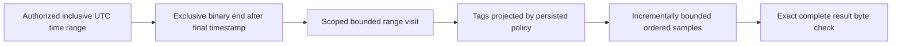
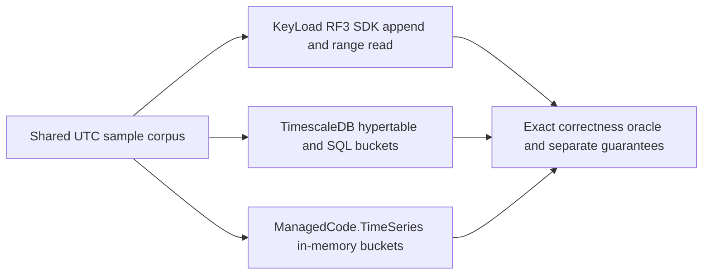
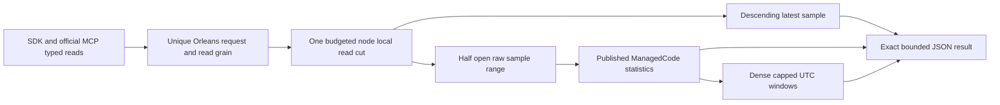
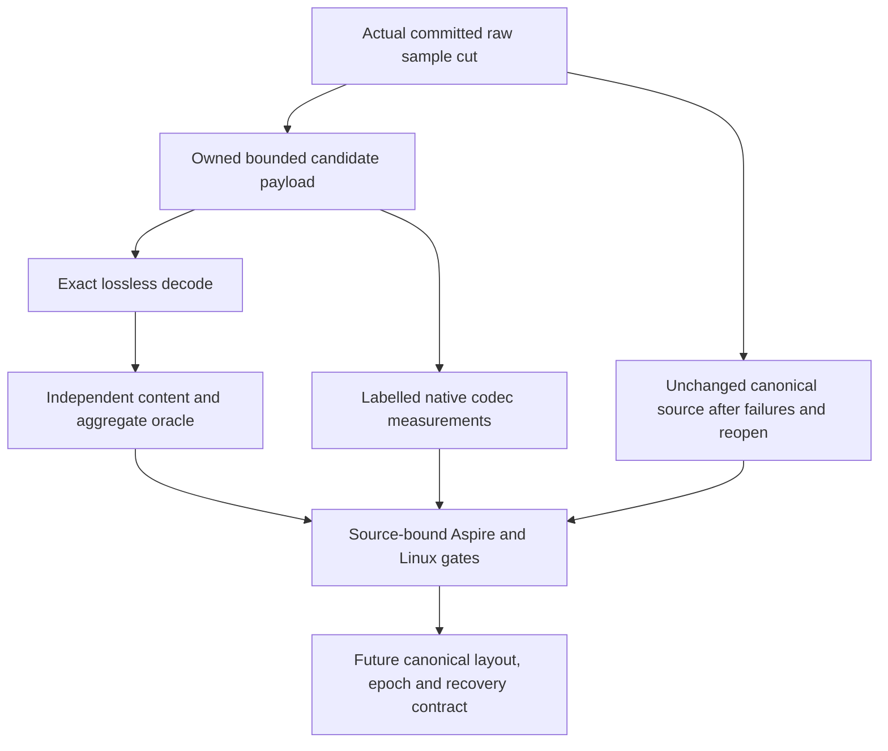

# TimeSeries

## Logged expiry stage of the 104-task completion

The owner directs completion of all KL tasks, with implementation before broad
stabilization. [ADR-073](../ADR/ADR-073-logged-series-retention.md) accepts the
following concrete KL-026 stage. Its predecessor requirements remain mandatory.

| Requirement | Measurable acceptance | Tests and owner |
|---|---|---|
| REQ-SERIES-013: logged monotone retention is atomic and bounded | AC-SERIES-013: only SeriesManage may submit expiry; future/backwards/invalid-page cutoffs reject without changing samples/floor; one command advances the floor and deletes <= MaximumDeletes; same-cutoff continuation and command replay preserve exact cumulative counts | SampleRetentionMutationTests, real ZoneTree; root joins RF3 SDK/MCP |
| REQ-SERIES-014: every series reader obeys the same exclusive floor | AC-SERIES-014: with physically retained older records, inclusive range, latest, half-open raw aggregates and dense windows return only timestamps >= Before; equal timestamp remains visible; Min/Max/offset/empty/request-before-floor cases preserve prior boundaries and dense anchors | SampleRetentionReadTests, all four actual APIs |
| REQ-SERIES-015: late data cannot resurrect expired history | AC-SERIES-015: a new ID below Before rejects the entire mixed batch; a retained identical ID deduplicates without adding a record; changed content conflicts; equal/newer samples succeed; sample sequence and ID receipts survive purge/reopen | SampleRetentionAppendTests and actual-file reopen; root joins process recovery |
| REQ-SERIES-016: native lifetime and failure contracts remain explicit | AC-SERIES-016: unknown/corrupt retention state fails closed, shared raw/result/deadline/cancel bounds hold, expiry waits for an actual read gate and leaves the following read healthy, reopen preserves floor/counts; no bucket/handle moves or ID-receipt deletion | SampleRetentionLifecycleTests, real storage gate; root recovery/RF3/format inventory |

Execution graph: TASK-104-SERIES-CONTRACT (root, shared contracts/docs, complete
before delegation) -> TASK-104-SERIES-EXPIRY (Luna/high, disjoint Core TimeSeries
and new tests) -> TASK-104-SERIES-JOIN (root, transport/recovery/Aspire RF3,
build/format/governance/GitHub evidence). Shared engine dispatch/config/docs have
one root owner. Agent completion means reviewed assigned source and authored tests;
parent KL-026 remains open until all expiry, rollup and qualification criteria pass.
Full prior suite baseline is the retained current-source qualification in status;
new unexecuted cases are not passing evidence. No new dependency or UI applies.

Status: bounded inclusive range source present; additive latest/aggregate/window
source joined under ADR-052, with its delivered-SHA CI and remaining gates pending.
[ADR-035](../ADR/ADR-035-memory-performance.md) maps REQ-MP-002 to AC-MP-005/012.

| Requirement | Acceptance | Evidence |
|---|---|---|
| REQ-SERIES-001: stop at the requested timestamp end before decoding later records | AC-MP-005 | Real-store narrow range with large later values, equal timestamps and min/max/offset boundaries |
| REQ-SERIES-002: one work/cancel/deadline and complete response budget | AC-MP-005 | Small raw/result budget failures, exact serialized boundary and cancellation with a healthy following operation |
| REQ-SERIES-003: retain UTC/sequence ordering, dedup and tag projection | AC-MP-005/012 | Existing real append/dedup tests plus persisted-policy range cases |

The existing operation includes both `from` and `until` timestamps; the repair
preserves that behavior. Equal timestamps remain ordered by persisted sequence.
ReadSamplesRequest's end description must reflect the actual inclusive contract.
Schema, append, retention, rollups, public JSON and SDK shapes are unchanged.
UI: N/A. New helpers and tests mirror Features/TimeSeries/. The lead owns shared
budget/clock, the existing GraphAndSeries.cs ReadSamples region, and endpoint
cancellation forwarding. This serializes the mixed legacy file under ADR-032.

Tests use real ZoneTree state and TUnit/MTP. Release/static development checks are
distinct from GitHub unit/recovery/RF3 SDK qualification and measured performance.

## Повний контракт часових рядів

Актори: producer samples, authorized range reader і майбутній retention/rollup worker. Current API: `AppendSamples`/`SampleData` у [contracts](../../src/KeyLoad.Abstractions/Contracts.cs), `ReadSamplesAsync` у [SDK](../../src/KeyLoad.Client/KeyLoadClient.cs); source [GraphAndSeries](../../src/KeyLoad.Core/GraphAndSeries.cs). Canonical identity: partition + resource/set + series; timestamps normalized to UTC та sequence визначає порядок equal timestamps.

| Вимога | Acceptance / positive, negative, edge, error | Test mapping |
|---|---|---|
| REQ-SERIES-004: append зберігає stable sample identity і finite numeric values | AC-SERIES-004: out-of-order input читається за UTC/sequence; same EventId/fingerprint не дублюється; changed content дає Conflict; nonfinite value відхиляється без partial batch | Existing `OutOfOrderSamplesStayOrderedAndSampleIdIsIdempotent`, `LargeFiniteVectorsAndSampleValuesRemainValidAndSimilarityDoesNotOverflow` у [GraphAndSearchTests](../../tests/KeyLoad.UnitTests/GraphAndSearchTests.cs); explicit mismatch/error expansion PLANNED |
| REQ-SERIES-005: ordered inclusive ranges зберігають authorisation і повну response межу | AC-SERIES-005: equal/min/max timestamps, empty range, limit і exact byte boundary дають визначений результат; unauthorized tags omit/deny за policy; exhausted/cancelled read не змінює data та не псує наступний read | Existing [TimeSeriesReadResourceTests](../../tests/KeyLoad.UnitTests/Features/TimeSeries/Cases/TimeSeriesReadResourceTests.cs); REQ-SERIES-001–003 та AC-MP-005/012 не замінюються |
| REQ-SERIES-006: retention, aggregates, rollups та compressed chunks мають окремі qualified contracts | AC-SERIES-006: PLANNED real-store tests доводять declared aggregation windows/late data/dedup, expiry/rebuild/recovery і bounds; raw oracle збігається з chunked representation; incompatible encoding відхиляється | PLANNED unit/recovery/resource suites для KL-025/026/078; ADR-079 adds the bounded codec stage below without closing canonical chunk/recovery acceptance |

Source-present baseline: sample append/order/dedup і inclusive bounded read. Planned: автоматична retention, rollups, chunk compression qualification та distributed series execution. Existing inclusive read repair keeps its wire shape; the additive aggregate/latest contract below is governed by ADR-052 and has separate pending source/qualification evidence.

Рішення: [ADR-005 keyspace](../ADR/ADR-005-canonical-keyspace-codec.md), [ADR-010 bounds/security](../ADR/ADR-010-query-budgets-security.md), [ADR-016 atomic/physical boundary](../ADR/ADR-016-atomic-physical-placement.md), [ADR-011 current native format](../ADR/ADR-011-current-native-format.md), [ADR-116 first-release format policy](../ADR/ADR-116-first-release-current-format.md), [ADR-030 retention/restore](../ADR/ADR-030-retention-paused-restore.md). Shared codec/storage/replication integration — один lead; feature helpers та matching tests `Features/TimeSeries/`. Frontend N/A. Product tests — real TUnit, process recovery, Docker/Aspire SDK/MCP у GitHub; runtime evidence для спільного source pending.

## ManagedCode.TimeSeries and Timescale comparison

REQ-SERIES-007 / AC-SERIES-007 map to REQ-BC-026 and AC-TSC-001..006 under
[ADR-050](../ADR/ADR-050-timeseries-timescale-comparison.md) and the
[time-series comparison acceptance](../ADR/ADR-050-timeseries-timescale-comparison.md).
The profile exercises KeyLoad's existing persisted RF3 sample API, a real
TimescaleDB hypertable, and the published `ManagedCode.TimeSeries` 10.0.0 library
for in-memory bucket aggregation at the original baseline. The current central
pin is published10.0.3 after the owning temporal and summer-allocation repairs;
its delivery receipt (report removed from repository)
verifies1107/1107 tests, module coverage, release/tag and actual signed NuGet
content before consumption. Four16-case native normal/scalar profiles qualify
the owning allocation change; they do not measure KeyLoad database throughput. REQ-SERIES-007/009/010/011 and AC-SERIES-007/009/010/011 retain their
existing real comparison and raw/window/date-edge/budget/security regression
oracles. Their new consumer-SHA GitHub execution is pending. The library is not
KeyLoad's persistence layer.
Reports keep persistence, recovery, replication, and acknowledgement guarantees
distinct; the public API and existing nine-engine matrix remain unchanged. The
comparison implementation and TUnit cases compile in the full Release solution.
Container execution, test results, and exact-SHA comparison artifacts remain
pending GitHub Actions qualification.

## Bounded latest, raw aggregates and dense windows

[ADR-052](../ADR/ADR-052-timeseries-bounded-aggregates.md) is Accepted before
implementation. It freezes exact DTOs, boundary/overflow/budget/security rules,
dependencies, ordered task graph, disjoint ownership and rollback. Acceptance
and execution criteria live in this Feature and the ADR; the durable
normative contract remains the ADR and this Feature. The comparison baseline's
existing API statement above describes ADR-050; it does not erase these additive
product APIs or relabel caller-folded benchmark statistics as server measurements.

| Requirement | Measurable acceptance | Automated mapping / TASK |
|---|---|---|
| REQ-SERIES-008: bounded latest at the current committed cut | AC-SERIES-008: descending UTC/sequence identity, inclusive optional cut, absence/min/max/offset/ties, one matching committed baseline entry independent of history | SampleLatestTests; TimeSeries SDK/MCP parity; TASK-SERIES-CORE-W8/RF3-W8 |
| REQ-SERIES-009: complete raw half-open aggregate using published native library | AC-SERIES-009: count/sum/min/max/raw average match independent reference for late/dedup/negative/empty/offset/date edges; null end includes MaxValue; finite overflow rejects safely | SampleAggregateTests and RF3 SDK/MCP oracle; TASK-SERIES-CORE-W8/RF3-W8 |
| REQ-SERIES-010: bounded dense UTC windows | AC-SERIES-010: anchor From, positive fixed Width, empty windows, final clamping, raw weighted average, date-edge arithmetic and caller/server window cap checked before allocation | SampleAggregateWindowTests and SDK/MCP windows; TASK-SERIES-CORE-W8/RF3-W8 |
| REQ-SERIES-011: one complete operation/security budget | AC-SERIES-011: positive caller caps, charged sample lookahead fails the whole aggregate, metadata/raw/exact result bytes/deadline/cancel share one view; current SeriesRead, projected latest tags and revocation; failures preserve data and healthy next reads | SampleAggregateBudgetTests, SampleAggregateAuthorizationTests and real RF3 persisted-authority cases; TASK-SERIES-CORE-W8/RF3-W8 |
| REQ-SERIES-012: typed public operations preserve real RF3 request isolation | AC-SERIES-012: .NET/HTTP/official MCP same results/errors/discovery schemas; old enum values preserved; genuine follower kill/restart retains results across all live replicas | TimeSeries RF3 integration, typed round trips and official MCP discovery; TASK-SERIES-SURFACE-R8/RF3-W8 |

Slice map: Abstractions/Features/TimeSeries read/result DTOs;
Core/Features/TimeSeries private readers/native accumulator and public static
TimeSeriesReadOperations facade; Client/Features/TimeSeries typed SDK;
Server/Features/TimeSeries HTTP routes. Shared ClusterRouting read-kind/dispatch,
ClientApi MCP catalog and ResourceExecution budget forwarding have one root
integration owner. StorageRecovery owns shared reverse range traversal under
REQ-STORAGE-013. Tests mirror TimeSeries in existing TUnit/MTP projects. Frontend
N/A: these typed database reads add no dedicated page. No conversion or backfill
of another sample format is supported; current sample keys/records/commits remain
unchanged under [CurrentFormat](StorageRecovery/CurrentFormat.md) and [ADR-116](../ADR/ADR-116-first-release-current-format.md).

Qualification uses independent raw-reference expected outputs and actual
ZoneTree/persisted policies in unit cases, plus genuine three-container .NET and
official MCP clients and isolated restart scenarios. No local tests/doubles or
claims based on source presence. Full same-SHA unit/recovery/RF3 suites and
configured quality gates are required. Numeric coverage/advanced retention,
rollups/SQL/compression/endurance/performance evidence remains open. ADR-052
remains Accepted, not Implemented, until its full implementation contract passes.

AC-SERIES-011 ingress proof: TimeSeriesHttpAdmissionTests competes each new
canonical route with an existing heavy query using the real shared admission
governor, checks rejection leaves the reservation unchanged and confirms healthy
admission after release. HttpAdmissionGovernor is a serialized root join; HTTP
and MCP route classification share the existing working-set ceilings.

R9 native failure loop preserves ADR052's public contracts. Cancelled d186
run37056851814 nevertheless retains terminal Linux/macOS unit868/870 and RF343/46
reports; those partial failures are not complete qualification. The valid raw-fold
fixture must use distinct IDs when content changes, while the new
SampleAggregateIdempotencyTests separately proves Conflict leaves canonical
samples unchanged and a following legitimate append/aggregate succeeds. The
earlier TimeSeries stage exercised53 tools. The current catalog has56 tools,
including aggregate replay and retention, with independently checked schemas,
routes/hints and the same ten blob operations. All three
SDK pre-cancelled reads use the existing shared transport's failed Result/Cancelled
problem; native official MCP cancellation keeps its existing exception semantics.
These are source-oracle corrections, not altered production dedup/transport rules.
REQ-SERIES009/011/012 and AC-QUAL004 trace to those existing/new real tests;
the exact corrected-source full GitHub suites and coverage remain mandatory.

## Lossless chunk codec qualification — ADR-079

[ADR-079](../ADR/ADR-079-lossless-series-chunk-codecs.md) freezes a private,
bounded generated-Orleans codec candidate before canonical storage integration.
Current per-sample ZoneTree rows, ID receipts, sequences, retention floors and
identity epoch7 remains unchanged. No conversion or rewrite of an earlier canonical
sample representation is supported. Codec qualification does not close KL-078:
correction generations and process/RF3 recovery still need their separate
current-format contract and original evidence.

The historical report (removed from repository)
records full Aspire normal/scalar2852/2852 verification and36 matched ordinary
BenchmarkDotNet cases with exact source/runtime/corpus binding. Canonical samples
still use their existing per-record ZoneTree representation. The measured controls
cover1/32/256 samples per batch; full database scale, current-format integration,
correction recovery, RF3 and exact-source Linux qualification remain required for
KL-078. No old-record conversion or canonical storage rewrite is supported.

| Requirement | Acceptance criterion | Planned automated evidence |
|---|---|---|
| REQ-SERIES-017: codec preserves exact ordered sample identity/content | AC-CHUNK-001: fixed and seeded 1..256-record roundtrips preserve SeriesId, EventId, exact TagsJson, local/UTC ticks, offset, sequence and IEEE bits; equal UTC ties and late sequence decreases preserve strict UTC/sequence order | SampleChunkCodec* TUnit, independent input/raw oracle including -0, subnormal, finite extremes, date edges and original offsets |
| REQ-SERIES-017: lossless text and aggregates preserve raw meaning | AC-CHUNK-002: valid Unicode and unpaired UTF16 code units survive without replacement; raw fold count/sum/min/max and all four real series-reader results remain unchanged by encoding/decoding; duplicate ID/content remains one canonical sample and changed content conflicts | SampleChunkCodec* and SampleChunkStore* real ZoneTree cases; no reassociated sums or tolerance |
| REQ-SERIES-018: counts, memory, work and failure are bounded | AC-CHUNK-003: 256 succeeds,257/empty reject as frozen; exact envelope admission/oversize and shared byte/deadline/cancellation cases fail whole before unsafe allocation; following real read succeeds and source bytes/cut/ID/sequence/floor remain unchanged | SampleChunkWire* and SampleChunkStore* real cuts, small/exact budgets, cancellation and actual reopen |
| REQ-SERIES-019: generated native format has explicit integrity and compatibility | AC-CHUNK-004: permanent chunk alias/Ids/native golden remain stable; checksum, truncated/trailing native/columns, nonminimal varints, invalid offset/timestamp/sequence/order/value/text dictionary/shape reject as Corruption; unknown versions are FormatUnsupported | SampleChunkWire* structural and independent malformed fixtures |
| REQ-SERIES-019: candidate cannot become a competing authority | AC-CHUNK-005: encoding at one actual authorized source cut writes no keys/files/journals, preserves the current SampleRecord contract and exact data after failure/reopen; private buffers release to the caller and no borrowed view escapes | SampleChunkStore* plus source review; storage/replica/public operation format changes forbidden in this stage |
| REQ-SERIES-020: qualification and performance claims have actual provenance | AC-CHUNK-006: full build/formatter/governance and Aspire TUnit normal/scalar results are source-bound; labelled BenchmarkDotNet controls retain corpus/machine/source/bytes/sample/encode/decode allocations and cost; current-format integration/recovery and acceleration remain explicitly pending | TASK-CHUNK-MEASURE/JOIN; genuine Linux CI and original artifacts required for global qualification |

Canonical slice map: Core `Features/TimeSeries/SampleChunk*`; TUnit
UnitTests `Features/TimeSeries/SampleChunk*`. Benchmark measurement is owned by
the shared [BenchmarkComparisons](BenchmarkComparisons.md) feature in
`benchmarks/KeyLoad.BenchmarkScenarios/Features/BenchmarkComparisons/` and uses
the existing KeyLoad.Benchmarks executable. Frontend, SDK/MCP/HTTP and
Orleans request surfaces are N/A for this transient private codec: their public
contracts are unchanged. StorageRecovery, CrashHost, RecoveryTests and RF3 chunk
integration are N/A for this transient codec candidate because no canonical chunk
is written; ordinary current-format integration and recovery remain mandatory
KL-078 work, not waived acceptance criteria. No legacy-record conversion is
supported.

## RF3 retention oracle correction (2026-10-04)

TASK-SERIES-RF3-ORACLE-JOIN preserves REQ-SERIES-013/016 and AC-SERIES-013/016 under ADR-073. Original Linux run37163610260 at f7e394f68e2971cab4bb0d9306fc7696e8211645 executed84 RF3 cases:82 passed and2 failed. The read-only principal's SDK assertion incorrectly indexed a nonexistent Problem extension instead of its canonical typed ErrorCode, so its subsequent MCP/progress checks were not reached. The follower-stop workflow received a permitted UnknownWriteOutcome but failed before reconciling its same command ID. Root corrects the typed denial oracle and reuses the existing bounded election retry with one captured command, then explicitly replays that command and checks identical commit token and exact cumulative retention progress. No authorization, acknowledgement, cancellation deadline or accepted error is weakened. New runtime qualification remains pending until original actual Aspire RF3 results pass.

Original KL-024 task acceptance is complete on the source-bound Linux Stage VII
cohort documented in [the canonical task status](../implementation/status.json).
Out-of-order and equal-timestamp samples read in defined order; retry does not change sample count. The receipt retains all original full-suite failures;
this task closure does not mark the complete feature or later source qualified.

Original KL-025 range/aggregate task acceptance is complete on the historical source-bound Linux cohort in [the canonical KL-025 task status](../implementation/status.json). Independent raw folds, dense windows, UTC/empty/late boundaries and charged scan caps passed both modes. Original full-suite failures remain retained; complete TimeSeries and current-source qualification are separate.

## TASK-KL026-BOUNDED-ROLLUP-001 — persisted explicit buckets

This bounded stage implements the missing original KL-026 sum/count/min/max bucket and explicit correction path. It does not close KL-026 or supply an automatic retention scheduler, chunk/sketch encoding, performance or RF3 qualification. Original REQ-SERIES-006 and AC-SERIES-006 remain mandatory. ADR-120 is Accepted before implementation.

| Requirement | Exact acceptance and whole-operation tests |
|---|---|
| REQ-SERIES-021: bounded canonical persisted bucket | AC-SERIES-021: explicit nonempty half-open UTC [From,UntilExclusive) bucket, UTC-equivalent offsets share one key; no floor-rounding or tick addition/overflow; native published ManagedCode.TimeSeries accumulator folds ordered raw UTC/sequence values into persisted finite sum/count/min/max and raw sequence/retention watermark; average is reconstructed by the same owned accumulator from sum/count; empty uses zero/null. SampleRollupWholeFlowTests and real SDK/MCP/SQL parity. |
| REQ-SERIES-022: revision, late correction, retention and lifecycle | AC-SERIES-022: ExpectedRevision0 creates; negative or long.MaxValue revisions reject Validation before increment, avoiding overflow; exact current revision corrects after any raw-sequence or exclusive-retention-floor change; stale snapshot read fails HistoryUnavailable until correction; From below floor rejects, equal floor allowed. Drop creates a monotone revision tombstone with no retained statistics, read returns that revision plus absent bucket, and recreate requires tombstone revision (no ABA). Matching original stable command replay returns the exact original receipt without new effects. Native reopen preserves stats/revision/watermark/tombstone; actual store read leases precede commit publication. |
| REQ-SERIES-023: authority and complete bounds | AC-SERIES-023: refresh requires current SeriesManage and SeriesRead; drop current SeriesManage; read current SeriesRead at the same node-local scoped cut. MaxSamples must be positive and <=existing MaxScanRecords; charged overflow lookahead fails the complete atomic batch. Selected state/watermark/raw reads obey existing MaxQueryReadBytes, generated native final frame/outcome limits, and centrally typed MaximumRollupBuckets bounds lifetime bucket identities including tombstones. Nonfinite aggregate/unknown or corrupt typed state fails closed. Read shares original token/deadline/raw/result budget; failed read changes no bytes/position and healthy follow-up succeeds. Replicated apply remains deterministic and finishes the existing admitted atomic log entry; it cannot introduce wall-clock mid-apply failures or rollback claims after submission. |
| REQ-SERIES-024: one native public execution path | AC-SERIES-024: RefreshSampleRollup and DropSampleRollup are actual typed Batch mutations through existing SDK CommitAsync, official MCP keyload_documents_commit and SQL dialect1 CALL of that canonical commit tool. ReadSampleRollupRequest maps one added native GrainReadKind through the existing separate request/read grain, typed SDK/HTTP/official MCP/on-demand schema/hints and shared SQL dialect1 CALL keyload_series_read_rollup. Raw samples/IDs/sequence/floor remain authoritative and unchanged by refresh/drop. Genuine RF3 SDK/MCP complete result parity, stable command replay, persisted-policy denial, late correction and healthy continuation are required. Full SQL/TIME_SERIES SELECT syntax and protocol claims remain open. |

Public typed contract: RefreshSampleRollup(SeriesSet,SeriesId,From,UntilExclusive,ExpectedRevision,MaxSamples); DropSampleRollup(SeriesSet,SeriesId,From,UntilExclusive,ExpectedRevision); ReadSampleRollupRequest(Partition,Set,SeriesId,From,UntilExclusive). SampleRollupResult exposes Revision and nullable Bucket so tombstones remain explicit. Bucket exposes normalized UTC endpoints, source sequence, nullable exclusive retention floor and SampleAggregate. No stored average or user tag/document/header content is persisted in rollup state. Each explicit bucket is one interval; adjacent intervals share no end sample, and no arbitrary width or implicit dense bucket allocation is accepted.

Append after the snapshot (including a late sample) changes the canonical per-series sequence and conservatively invalidates every snapshot of that series, even an unrelated interval. Identical retained IDs do not advance sequence and leave the snapshot current. Expiry-floor movement also invalidates snapshots without returning expired history. Raw values are never inferred from old snapshots. Correction recomputes the complete admitted range against actual native raw records under the ordered atomic transaction; deterministic ordinal native numerical semantics and finite overflow rejection remain unchanged. Wrong revision rejects the whole batch; original stable command receipts are subject to existing fresh authorization/incarnation/fingerprint checks.

Persistent current-format state has a version discriminator, permanent generated Orleans alias and stable field IDs, normalized endpoints, monotone revision, dropped flag, raw sequence/floor watermark and count/sum/min/max. Validate shape/key/ranges/count/extrema/finite values before use; unsupported version is FormatUnsupported and malformed state is Corruption. One new partition record family participates in the existing roster/transfer inventory. No runtime JSON fallback, old-format reader, raw rewrite or separate provider is introduced. MaximumRollupBuckets is centrally bound through existing TimeSeriesExecutionOptions; tombstones count against the limit and are not silently purged. Reader lease ownership remains the existing real node-local store read/commit gate; no grain owns an open storage handle.

```mermaid
flowchart LR
  Caller[SDK official MCP shared SQL] --> Request[Separate native request grain]
  Request --> Apply[Ordered RF3 node local atomic commit]
  Apply --> Raw[Canonical bounded ordered raw scan]
  Raw --> Native[Published ManagedCode native accumulator]
  Native --> Bucket[Typed stats revision and watermark]
  Bucket --> Read[Current authorized scoped point read]
  Read --> Mean[Same accumulator sum divided by count]
```

Ownership and stages: root freezes this feature and ADR120; private feature worker owns Abstractions/TimeSeries contracts, Core/TimeSeries command/records/read helpers and mirrored TUnit unit/RF3 whole flows. Root alone joins shared mutation/authorization/normalization/record-family/native-read-kind/HTTP/MCP catalog and current SQL conformance appendices, preserves KL087 overlapping source and runs format/build/genuine native discovery. Actual tests must seed two boundaries and empty window, literal stats, late stale/error and expected-revision correction, exact stable replay/full-store/position, denial/revocation, overcap and cancellation/no partial/no effects, native reopen and healthy operation. Required Linux full normal/scalar/recovery/RF3/coverage gates and original failed receipts stay distinct. This private authored packet claims no native inventory/PASS/coverage or task closure.

Current ManagedCode.TimeSeries central pin is 10.1.1; use its existing native DoubleTimeSeriesSummer path through SampleAggregateAccumulator without package changes or inferred old-version qualification. An owning dependency defect requires the mandatory sibling repair/release/feed process. Rollout adds only the current typed model/API; rollback requires a coherent reviewed deployment removing routes/mutations and rebuilding or discarding only explicitly disposable derived bucket state while retaining every raw sample/ID/sequence/floor. No automatic destructive rollback, compatibility shim or raw-format migration. Frontend N/A: a bounded database operation has no dedicated UI.

## TASK-KL026-AFTER-NATIVE-WORK-002

REQ-SERIES-023 / AC-SERIES-023 under ADR120: original caller cancellation and elapsed deadline are tested only after actual owning ZoneTree borrowed point diagnostics advance through the admitted scoped read. The permitted owning TimeProvider inspects the same real store counters at native budget checks; it cancels the original token or advances only its own elapsed timestamp beyond the unchanged centrally typed cap. It cannot provide values, authorization, storage or successful results. Complete canonical bytes and position remain equal, original token or exact BudgetExceeded/detail is required, no partial SampleRollupResult exists, and a fresh budget on the same store returns the literal current bucket. Native query/storage providers remain genuine. No sleep, polling timeout, cap widening, parallel dispatcher or product test hook is introduced.

These authored tests do not claim observed native execution, and do not supply concurrent lease-blocked drop timing evidence. The current ordinary read/commit gate remains the authority; its private pending-writer state is not inferred from scheduling or a pre-call signal. KL026 remains open.

REQ-SERIES-024 / AC-SERIES-024 additionally exercises the unchanged original generated CommandRequest via genuine Q1 `CALL keyload_documents_commit(@arguments)` on SDK and official MCP, then canonical official MCP and SDK replay. Every returned CommitReceipt must serialize to the original native bytes including position/mutation identities/revisions; independent literal complete raw SampleRecord arrays and subsequent literal rollup watermark/revision establish no duplicate effects. This uses the factory's embedded CommandRequest.commandId, never a fresh command ID or retry loop. Original native execution and RF3 qualification remain pending.

TASK-KL026-BOUNDED-ROLLUP-001 / REQ-SERIES-024 / AC-SERIES-024 and existing REQ-PMOVE-001 / AC-PMOVE-001: new native `sample-rollup-v1` records, including CAS tombstones, belong to the same four-component canonical partition family inventory. The independent literal PartitionRecordInventoryTests matrix must include this family in ordinal order (58 authored families), then actually seed and read every native family through the existing complete native page fixture. This is contract source maintenance, not a discovered test count, installed transfer protocol or runtime qualification. Raw samples and their original families remain intact.

## TASK-KL026-REAL-LEASE-DROP-003

REQ-SERIES-022 / AC-SERIES-022 and new REQ-STORAGE-GATE-001 / AC-STORAGE-GATE-001 freeze a native per-open-store gate diagnostic before implementation. ZoneTreeGateSnapshot carries only the existing ephemeral read SessionId and the native ReaderWriterLockSlim.WaitingWriteCount as WaitingWriters. The scalar counts all pending write-gate users, not only commits; it is not a receipt, readiness/authority token, consistent multi-field cut or durability proof. No key, principal, credential, path, payload, callback, event handler, exported metric label or unbounded history exists. Sampling acquires no store gate, scans no records, mutates no storage and allocates no retained collection; the owner must remain open through sampling and cleanup. No HTTP/SDK/MCP diagnostic route is added. Native storage owns this observation; Orleans still owns actual requests and node-local storage/commit authority.

Actual whole flow: seed and refresh a literal real bucket; hold its existing authorized budgeted SampleRollupReader inside the actual store Read callback, and retain only a detached literal result. Submit exactly one actual stable-ID Drop on a joined native worker. Under the unchanged original five-second scope bound, observe same-session WaitingWriters>0 while the first actual read gate remains held; only then release and join the actual reader and writer. Verify first complete literal bucket, exact native drop receipt kind/revision, raw/ID/sequence/floor authority unchanged, revision tombstone, stable-ID replay full bytes/position unchanged, and a genuine CAS recreate/read healthy continuation. The condition is actual native queued writer work, not Task.IsCompleted, a pre-call signal or a scheduling delay. Full bytes inside the held real gate remain equal to the pre-drop cut. Native observations and controller/worker errors must settle before owned store disposal; primary and cleanup failures are retained. No runtime proof or KL026 closure is claimed from authored source.

### TASK-KL026-ROLLUP-PROCESS-001: original process cuts

REQ-SERIES-022 / AC-SERIES-022 under ADR-120: distinguish graceful reopen from actual process termination. The existing CrashHost, original CanonicalCrashBoundary and bounded joined child owner must exercise both RefreshSampleRollup and DropSampleRollup. Each case kills one child after its acknowledged revision-one refresh and a second child at the next canonical JournalFlushed before apply. Original samples/IDs/sequence/exclusive retention floor remain byte-identical. Independent literal parent assertions require all four original samples, exact half-open bucket count3/sum12/min2/max6/average4, sourceSequence4 and retention floor at From; inflight refresh recovers revision2 statistics and inflight drop revision2 tombstone. Exact original acknowledged receipt and recovered stable-ID receipt replay without new bytes/position; changed payload is Conflict with no bucket/raw effects, its original failed replay has no effects. Healthy refresh/drop/recreate reaches revision5 and a fourth distinct child reopens that complete state. Preserve native current format, aliases/field IDs, original child/output/timeout bounds and primary plus cleanup failures. No production hook, migration, power-loss or qualification claim. Root owns native full recovery and exact-source Linux execution before original KL026 closeout.

Ownership: CrashHost Features/TimeSeries Contracts/Helpers hold only test scenario protocol and actual native operations; RecoveryTests Features/TimeSeries Cases/Helpers/Assertions own child lifetimes and independent literal oracle. Existing shared DocumentStorage CommandIdempotencyProcessChild/Cleanup and StorageRecovery trial/readiness facilities retain their original ownership and limits.

### R442 rollup process receipt oracle correction

REQ-SERIES-022 / AC-SERIES-022 and ADR-120 retain exact acknowledged and recovered command receipt authority. Native `MutationReceipt` includes the normalized empty composition-reference field; generated record equality also compares its `ImmutableArray` backing storage and therefore is not a native payload identity oracle after deserialization. The process parent and child compare the complete native serialization of each actual mutation with an independently constructed literal expected mutation, retaining kind, resource, ID, revision and empty composition authority. Original R442 failures remain evidence; this source correction is unexecuted until the genuine refresh/drop process flows pass. No receipt/state/deadline or binary contract changes.

## TASK-KL026-ORIGINAL-ACCEPTANCE-CLOSEOUT-001

All four original KL-026 acceptance clauses are delivered at source aa10337b159eaf3ea012f29b7c3f4645d7557aac in original Linux run [37686560768](https://github.com/managedcode/KeyLoad/actions/runs/37686560768). The original criteria are expired data absent, identical replay between nodes, reader-lease ordering of bucket drop and rollup average recovered from sum/count. This closes original KL-026 only; broader TimeSeries/RF3/coverage/fault/endurance/performance and current changed-source qualification remain open. ADR-073 and ADR-120 retain the implementation contracts.

| Original acceptance | Original actual operation evidence |
|---|---|
| Expired data is absent | SampleRetentionReadTests, SampleRetentionAppendTests and SampleRollupPolicyTests execute native logged expiry, late data, retained IDs, full read cuts and literal rollup invalidation without resurrection. Their normal/scalar results pass. |
| Replay is identical between nodes | RF3 SampleRollupRf3Tests.AcSeries024NativeSdkOfficialMcpSqlLateCorrectionAndOriginalReceiptParity passes. SDK node3 and official MCP node2 submit the same immutable command through canonical commit and Q1 CALL; all complete receipts match original native bytes, full raw rows remain literal and unchanged, and both callers return literal rollup revision/watermark/arithmetic before and after late correction. |
| Bucket drop waits for reader leases | SampleRollupLeaseDropTests.AcSeries022NativeQueuedDropWaitsForRealReadLeaseThenReplaysAndRecreatesHealthyBucket passes in both normal/scalar modes with an actually held node-local read lease, joined queued drop, complete replay/state and literal healthy recreation. |
| Average recovers from sum/count | SampleRollupWholeFlowTests proves literal count3/sum12/average4 then count4/sum22/average5.5; SampleRollupProcessRecoveryTests proves acknowledged and journal-flushed process cuts, restored literal arithmetic and healthy continuation. Process kill does not establish power-loss durability. |

The 65 selected original normal/scalar/recovery outcomes pass, and the original RF3 case passes in required report SHA256 2a72433fac153d933b24cb86d038eca3d7698a18280a76179bfedad1140fc3af. Root verified 1693 original Git source/central hashes against authentic native DLL/PDB/MVID compile declarations for the RF3 test and eleven participating modules; binding SHA256 f95f035368babf23124024e2140a6e5abb5a96e05b21175c39f15cdaef86c400. Authenticated original image manifest is sha256:b142fa977376d69aba9bd27f3f443a10aea9aad039b319ad30404c04f0abac24. Exact original artifacts remain attached to verify job113015831034 and RF3 job113015778654. The whole run failed: required RF3 170/185, covered RF3 0/11 and one unrelated normal graph-cancellation failure are retained. No overall green run, coverage percentage or current-source qualification is claimed from this scoped acceptance closure.

## TASK-KL078-NATIVE-PERSISTED-CHUNKS-001

# KL078 whole native chunk implementation contract — source freeze R1

Original task: architecture §27.6 and KL078; existing REQ-SERIES-017..020 / AC-CHUNK-001..006 remain unchanged transient codec controls. This stage adds REQ/AC-SERIES-CHUNK-007..012. No benchmark, power-loss, acceleration or whole-task PASS is implied by source.

007: A persisted, same-atomic-partition open window receives every new acknowledged sample in its exact half-open UTC range. Equal UTC timestamp uses actual original sample Sequence, original offset and IEEE bits; duplicate EventId retains original existing fingerprint semantics. Enrollment starts only at an admitted canonical source cut; no backfill or migration. Explicit Open rejects any preexisting raw sample in the window (no synthesized old enrollment), overlap and retained identity reuse. Fresh current persisted SeriesManage/SeriesRead and ordinary SeriesAppend remain required.

008: Seal captures exact original open native rows and source watermark, writes immutable native SampleChunkPayload blocks and immutable complete generation manifest in the same original apply transaction. Raw sample/id/sequence/floor remain the single canonical business authority. A late unique sample atomically appends raw data plus a bounded immutable correction block and advances the exact window revision; overflow rejects the entire attempted mutation before publication. The original sealed manifest is never patched. Same original command replay returns the actual unchanged receipt and cannot append corrections twice.

009: Background maintenance uses existing native Orleans Durable Jobs and RF3 RuntimeJournal provider, not a timer/parallel dispatcher. A window retains its original creator and exact expected generation/revision; the job revalidates current persisted principal/resource/field policy before submitting a separately signed Batch through a fresh unique RequestGrain. Job at-least-once replay uses one stable persisted command identity. Merge publishes a new complete immutable generation and retires bounded prior representation/corrections only in the same atomic apply transaction. No expiry renewal, caller roles, callback-only success or unpublished local provider. Queue admission is centrally bounded; revocation refuses and retains state, exact grant repair allows genuine healthy continuation.

010: New explicit chunk-window read returns the exact complete scoped native window identity/generation/revision/source-sequence/retention floor/records at one authorized owner cut. Public tag equality is one scalar JSON pointer/value comparison; field-use permission is checked before pruning and current field projection still applies to every returned sample. Manifest native tags conservatively admit candidates; pruning cannot reveal denied/private tags or bypass raw-byte/record/result budgets. Selected encoded block is charged before decode/copy. Missing/corrupt/version-incompatible enrolled representation fails closed, never falls back to old raw rows. Unenrolled series continue their existing deliberate raw read API, with no legacy migration path.

011: Retention floor remains authoritative immediately. Fully expired enrolled windows retire representation only through an authorized bounded native mutation; partially expired windows retain charged blocks and filter exact floor on reads. Rollup metadata retains original SourceSequence and RetentionBeforeUtcTicks; chunk-generation selection cannot move either watermark or skip late samples. Rollup refresh/drop keep original CAS and current authorization.

012: Complete normal/scalar codec+canonical lifecycle controls, original process kill/reopen at real open/append/seal/correction/new-generation publication boundaries, genuine Aspire RF3 SDK/official MCP/Q1 open→append→seal→late correction→background merge→retention/rollup→cold/replay/healthy state qualify actual correctness. Overload, wrong generation, mixed-model atomic rollback, cancellation/read bounds, corrupt manifest/block, revoked/tag-denied principal must have complete cut/receipt/no-partial oracles then healthy repair. GitHub original comparable bytes/sample/rewrite cost/allocation measurements remain REQUIRED and separate; no source or BDN microcontrol promotes performance.

## Native identities and schemas (current product, not upgrade/fallback)

All internal fields use generated Orleans serialization. Existing SampleChunkPayload alias and Ids0..9 stay exact. Key families are `sample-chunk-window` (mutable lifecycle metadata), `sample-chunk-block` (immutable generation/ordinal), `sample-chunk-correction` (immutable actual sample sequence), `sample-chunk-manifest` (immutable generation), scoped through KeySpace.Partition with actual tenant/database/domain/partition/set/series/window. WindowId is caller-stable nonempty Guid; no hidden directory/path.

SampleChunkWindow native alias `keyload.core.sample-chunk-window.v1`: Id0 Version; 1 WindowId; 2 FromUtcTicks; 3 UntilUtcTicks; 4 Revision; 5 Generation; 6 State(Open=0,Sealed=1,Dropped=2); 7 CreatorPrincipalId; 8 SourceSequence; 9 OpenRecords; 10 CorrectionSequences; 11 MaintenanceCommandId; 12 RetentionBeforeUtcTicks. All counters checked; no current epoch stored as future authorization.

SampleChunkManifest alias `keyload.core.sample-chunk-manifest.v1`: Id0 Version;1 WindowId;2 Generation;3 FromUtcTicks;4 UntilUtcTicks;5 SourceSequence;6 RecordCount;7 BlockDigests;8 TagJsonValues;9 RetentionBeforeUtcTicks. SHA256 binds actual complete native bytes per block and actual full manifest, not authority MAC. No invented future error/message bounds.

Public four Batch mutation aliases/discriminators: OpenSampleChunkWindow / `openSampleChunkWindow`; SealSampleChunkWindow / `sealSampleChunkWindow`; MergeSampleChunkWindow / `mergeSampleChunkWindow`; DropSampleChunkWindow / `dropSampleChunkWindow`. Native aliases `keyload.v1.<TypeName>`; each Id0 SeriesSet,1 SeriesId,2 WindowId; Open Id3 From,4 Until; other mutations Id3 ExpectedRevision. The original inherited Mutation Resource scope is unchanged. New read request alias `keyload.v1.ReadSampleChunkWindowRequest`: Id0 Partition,1 Set,2 SeriesId,3 WindowId,4 TagPointer(nullable),5 TagValue(nullable),6 Limit. Result alias `keyload.v1.SampleChunkWindowResult`: Id0 WindowId,1 From,2 Until,3 Generation,4 Revision,5 SourceSequence,6 RetentionBeforeUtcTicks,7 Records,8 CutPosition. The operation uses existing bounded SDK/MCP/Q1 read infrastructure and one appended native GrainReadKind, never a second transport.

## Bounds and ordered apply

New purpose-owned properties on the existing centrally registered IOptions<TimeSeriesExecutionOptions>, retained by the existing constructor without provider defaults or per-call wrappers: maximum retained windows32, records/window4096 (=16 original256-record codec blocks), corrections/window256, pending merge jobs32. Each minimum1 and ceiling exactly its declared default; enrollment checks the actual configured DatabaseLimits.MaxScanRecords before any chunk write. This is a feature admission relation; it does not reject unrelated databases with a smaller scan bound at startup. Encoded individual block remains existing8MiB but actual batch/frame/native metadata limits can be smaller and still reject. Existing options/deadlines/append10000/results/native reader and RF3 limits are unchanged. These explicit operational caps are not RSS or performance proof.

Native ApplyCommittedCommand uses the original admitted operation business time and cannot introduce follower-local wall-clock/cancellation decisions after ordered admission. Existing codec read callers retain exact ReadExecutionBudget token/deadline checks. A purpose-owned value-type codec work adapter borrows that same budget for those callers; ordered canonical codec uses only deterministic already-validated record/byte limits and native transaction ValidateCommit. No artificial TimeProvider, renewed token, reset deadline or cancellation swallowed before admission. Original caller token remains effective on request preparation/read/transport, while the acknowledged RF3 journal remains deterministically applicable.

## Ownership/order/qualification

1. This contract plus TimeSeries/ADR124 appendices before implementation; ADR124 is reserved only if the live number/path is absent.
2. Abstractions TimeSeries typed roles; Core TimeSeries contracts/storage/commands/queries/serialization/config; additive shared Mutation discriminators/authorizer/dispatcher; Orleans TimeSeries native coordinator/DurableJobs registration and native read branch; Server/Client existing typed transport; independent literal catalog tuple addition coordinated with root.
3. Unit full native lifecycle/mixed rollback/privacy/corruption/cancel controls; Recovery real CrashHost cuts; Integration genuine Aspire SDK/official MCP/Q1/cold/job revoke→healthy, all original readers/processes/resources joined.
4. Root sole guarded live join/compiler/census/Linux evidence owner. New source methods/arguments are not native UID/count/PASS. Normal/scalar and every mandatory global suite/performance/fault gate remain open until authenticated exact-source originals.
5. Rollback unpublished source as a coherent stage only; after publishing records no format downgrade, metadata deletion, automatic raw fallback or fabricated current authority.

R2 clarification: MaximumChunkWindows=32, MaximumChunkWindowRecords=4096, MaximumChunkCorrections=256 and MaximumPendingChunkWindows=32 are centrally validated purpose-owned properties on the existing TimeSeriesExecutionOptions. Existing registration/OptionsFactory remains. The same original IOptions owner is retained for codec calls; no Options.Create/default wrapper. Durable job hints confer no rights; creator/current state is reread at the native current barrier before unique RequestGrain dispatch. Existing configured DurableJobs concurrency/attempt/catalog bounds remain authoritative. A merge CAS failure is genuine persisted outcome; a revised authoritative window intent has a distinct stable command identity and cannot silently change the body under the failed ID.

## TASK-KL078-NATIVE-JOB-ADMISSION-002 — bounded recovered scheduling

The pinned Orleans 10.4.0-alpha.1 ILocalDurableJobManager ScheduleJobRequest has no caller JobId or query-by-intent. A disposable dictionary cannot bound restart scheduling. The partition coordinator therefore declares IDurableStateManager.GetOrAddDictionary<Guid, SampleChunkJobAdmission>("time-series-chunk-admissions-v1") during construction, using the EXISTING explicitly OrleansBinary RuntimeJournal owner. Native journal registration/recovery must complete before activation. No new storage provider or JSON format.

SampleChunkWorkHint alias keyload.core.sample-chunk-work-hint.v1 Id0Partition/1Set/2Series/3WindowId/4Generation/5Revision/6Creator/7Seal(bool)/8CommandId/9CreatorPolicyEpoch. Hint confers no authorization; exact current window/version/body and actual persisted creator/policy are read after the owning current barrier. Command identity is canonical sortable key SHA256, including scope/window/generation/revision/kind/actual creator policy epoch, not serializer reference graph. The same hint retains exact command/body. Distinct corrected intent gets a distinct ID.

SampleChunkJobAdmission alias keyload.orleans.sample-chunk-job-admission.v1 Id0Hint/1JobId(nullable)/2BlockedPolicyEpoch(nullable). Count is bounded by existing centrally validated MaximumPendingChunkWindows (1..32) PER atomic-partition coordinator, including schedule-uncertain and policy-blocked entries. Persist original entry BEFORE the one ScheduleJobAsync call. Successful scheduling persists returned actual job Id; failed/uncertain scheduling retains original charged entry and initiating failure. Never retry scheduling that entry or synthesize provider outcome. A native handler with exact target/name/metadata may reconcile the original actual scheduled job. Absent outcome remains charged; only actual authorized manual seal/merge/drop changing the canonical original intent permits retirement after current barrier. No operation deadline/expiry renewal or alternate authority.

Native handler validates exact closed metadata and original admission, reads fresh persisted creator/current SeriesManage|SeriesRead/resource at the same native barrier, then uses original native signed ManagedCode CQRS stream and NEW unique IRequestGrain. Genuine successful command, already-ineligible original intent, or changed canonical revision settles that original entry after barrier. Permission/auth failure retains blocked original entry/actual epoch (no repeated job scheduling under unchanged policy). A changed actual epoch permits a distinct provider attempt only after the original actual denial settled; its distinct epoch-bound command identity avoids replaying the immutable failed outcome. Every unchanged intent+epoch retains exact original command ID/body. Cancellation/uncertain native effect retains entry and native provider at-least-once retry, with stable command ID. Every journal write failure deactivates admission before further calls; never treat unacknowledged in-memory removal as durable capacity.

Leader GrainService discovery is bounded native page traversal with original read token/bytes, current owner read barrier and scope-key validation. Its afterKey is disposable and resets across physical incarnation. GrainService stopped token and RuntimeJournal admission cancellation join original in-flight scheduling/reads before shutdown. Native provider concurrency/attempt/storage limits remain unchanged; this admission bound does not claim a global cluster queue size, exact job timing, latency or RSS measurement. Authored RF3 restart/uncertain/overload→healthy/permission-change tests are required before qualification.

## TASK-KL078-NATIVE-JOB-CREATOR-003 — held real request denial and repaired background continuation

REQ/AC-SERIES-CHUNK-009/012: the test independently derives only the closed canonical maintenance CommandId from the actually persisted creator epoch/window/generation/revision and original key codec. This is a probe selection identity, not the native provider JobId, signing authority or an invented outcome. Before the correction becomes eligible, arm the existing AuthorizationReload Hold for that creator/command. Genuine background dispatch must produce an actual signed request marker. Revoke that actual principal through the SDK, compare the full correction-bearing native window/rows with no partial effect, release the same actual RequestId, then require original Released and ProducerDisposed markers before retiring the arm. The old signed request must not publish a generation. Restore the persisted grant with a genuinely new epoch; only the corresponding newly derived canonical job intent can drive real background merge. Verify complete SDK/MCP/Q1 literals, original creator receipt replay and a true same-root native AppHost restart with fresh callers. All original keys, six owners, ports, limits and operation/fixture deadlines remain unchanged. No synthetic journal row, caller role, provider outcome or retry is introduced.

Failure cleanup releases/joins every original armed request through existing signed cohort and native wave ownership before deleting resources. This source case does not qualify scheduler-uncertain crash or the 32-admission overload boundary; those separate provider fault gates remain explicit.

## TASK-KL078-NATIVE-FAMILY-MATRIX-004 — independent complete native family pages

REQ/AC-SERIES-CHUNK-007/012 and AC-PMOVE-001: extend the independently literal canonical partition-family inventory from 58 to 62 with exactly `sample-chunk-block`, `sample-chunk-correction`, `sample-chunk-manifest` and `sample-chunk-window`, in ordinal order. Preserve every original family literal and the existing genuine native store seed, bounded page read, exact full key bytes and value bytes for every family. `PartitionRecordInventoryTests.AcPmove001InventoryAndNativePageCoverEveryPartitionFamily` remains the same complete operation; this adds no test identity or count-only substitute.

Source audit confirms canonical key validation and restored roster admission use the actual dynamic `PartitionRecordFamilies.All` membership, and future movement descriptor sizing charges every actual family name through its existing dynamic loop. Preserve these owners and formulas unchanged. This source successor is not native discovery, execution, restore/movement qualification or a performance claim. Existing recovery/RF3/fault gates remain required.

## TASK-KL078-NATIVE-EARLY-PROCESS-CUTS-005 — genuine Open/Append/Correction recovery

REQ/AC-SERIES-CHUNK-007/008/012: retain the existing Seal/Merge process cases and add actual Open, initial Append and late Correction commands killed at the existing native CommitStage.JournalFlushed observer. Each original prepared child configures its real resource and stores its genuine successful original outcome before the fault child starts. No window exists before Open; Append starts from the actual empty enrolled window; Correction starts from the actual acknowledged sealed two-row generation. Independent full observations include exact literal rows/window revision/generation/source sequence and native raw family images.

The original replicated operation is persisted before arming the existing observer, automatic native recovery occurs on reopen, and replay of those exact bytes must preserve the complete native store and recovered cut. The original configuration outcome remains byte-identical. Real healthy continuation seals, appends the distinct late sample when needed and merges a complete generation; a second cold process replays both original operations without effects and preserves the full healthy snapshot. Original run deadline, pipe bounds, owned kill/readers/process settlement and native file-lock checks remain unchanged. No public schema, journal format, clocks, limits or Program dispatcher changes. These three authored process cuts do not qualify power loss, scheduler-uncertain recovery, pending-job overload or RF3/background/performance gates.

## TASK-KL078-NATIVE-RF3-RETENTION-ROLLUP-006 — complete enrolled representation and canonical watermark

REQ/AC-SERIES-CHUNK-011/012: extend genuine Aspire RF3 qualification with a distinct complete SDK/official MCP/Q1 enrolled-window flow. Preserve the existing background merge/creator/privacy cases. After actual open→one original three-sample append with synchronous first-sample seal and two corrections→background merge, create the canonical rollup from the same raw authority. Partial retention removes the two equal-time original samples while leaving the late sample, preserves exact immutable generation/revision and exposes the actual floor/source sequence in every chunk read. The original rollup becomes HistoryUnavailable; a fresh floor-aligned rollup has a complete independent literal aggregate and captured canonical source/floor.

Full retention followed by authorized Drop makes the original window HistoryUnavailable; replay of its original acknowledged append receipt cannot resurrect it. Native rollup drop preserves exact CAS semantics. A distinct fresh window/sample/rollup uses the next actual source sequence and the unchanged retention floor. Compare complete literals and complete original receipts through SDK, official MCP and both Q1 routes, then genuinely kill/join/restart all three fixture-owned resources at their same roots and repeat the full healthy and retained-history refusal oracles with fresh callers. No caller role, fallback to raw enrolled data, altered budget/deadline/limit, new snapshot or synthetic scheduling outcome. Pending-job overload/uncertain-schedule and GitHub measurements remain separate open gates.

## TASK-KL078-NATIVE-REVOCATION-COLD-OWNER-008

REQ/AC-SERIES-CHUNK-009/012: the existing creator-revocation RF3 flow calls RestartJoinedAsync, whose actual same-root capacity owner requires protectedDocuments and retained original three parameter/six port bindings. StartProbedRemoteQueriesAsync does not meet that actual precondition. Use the existing StartProtectedDocumentsAsync owner, which retains register/remote/query/probe and enables the required same-root reconstitution. Preserve all original six resources, membership/profile/image/credentials, held AuthorizationReload cancellation/disposal, exact creator-policy refusal and fresh epoch merge, complete SDK/MCP/Q1 literals, original receipts and cold oracles. No budgets/limits/defaults/native admission or identity changes. Source-only correction; actual Linux qualification remains required.

The actual existing arm validator and server private JSON principal validator require the exact c1-probe- prefix. The old fixture-generated chunk-creator- principal did not satisfy that strict admission. Generate the real persisted creator with c1-probe-chunk-creator- instead; configure its actual API key and native window creator metadata from that same returned PrincipalRecord. No validator relaxation, caller role, persisted format or production principal migration; every original authorization/revocation/epoch/receipt oracle remains.

## TASK-KL078-NATIVE-SCHEDULER-GATES-007 — actual coordinator admission and provider uncertainty

REQ/AC-SERIES-CHUNK-009/012: the existing per-partition durable coordinator retains its unchanged maximum32. Distinguish this actual coordinator admission predicate from per-series pending-window capacity. Thirty-two distinct same-partition series each retain one genuine canonical late correction and one native admission persisted before an actual ordinary probe failure. Require all32 original FaultRequested and ProducerDisposed witnesses. The successful correction receipt and canonical rows remain valid; scheduling refusal is not database rollback. No 33rd probe arm or increased probe limit.

The candidate33 uses the exact native generated Warning message at the actual coordinator quota predicate, bound to its independently derived original maintenance CommandId and ResourceExhausted. Three bounded original Aspire ResourceLoggerService.WatchAsync readers own cancellation, async disposal and joined settlement; retain only the exact matching original message within the existing8192-byte probe record bound. No logger counter, extra client request, fabricated outcome or alternate authority. Cold reconstitution must preserve32 charged records and the same refusal. Actual public manual Merge settles an original intent, native RetireSettled frees only that record, and candidate33 then completes through the real background provider. Complete independent window/raw/receipt literals through SDK, official MCP and both Q1 routes cover all original work, distinct fresh work and a second true cold.

A separate original provider-returned hold occurs after the same actual ScheduleJobAsync Task returns its genuine job and before JobId persistence. Joined original AppHost shutdown cancels and joins the owning Schedule producer, then same-root reconstitution reconciles only the actual original job's canonical effect. No uncertain absence rescheduling. Three appended closed private phase names preserve every existing ordinal/marker/identity/privacy/budget contract. The default null observer remains unchanged. Actual Linux qualification of abrupt process-kill provider uncertainty and representative GitHub performance remain open; caller task completion never substitutes for original provider settlement.

Source map: Orleans TimeSeries SampleChunkCoordinatorGrain/SampleChunkJobDiagnostics; existing ClusterRouting GrainRequestPhase and server RequestCqrsProbeContracts/Records/Json append-only stages; Integration TimeSeries Cases/SampleChunkSchedulingRf3Tests and bounded Contracts/Helpers/Assertions/Diagnostics responsibilities. Related ADR124; authored selectors are source-only until fresh native metadata and Linux normal/scalar execution bind them.

Pinned provider ordering correction: Microsoft.Orleans.DurableJobs10.4.0-alpha.1 commitd114d7522a53b8cce4c6b97d44293e5c7273d766 IDurableJobReceiverExtension.HandleDurableJobAsync is AlwaysInterleave and directly invokes handler.ExecuteJobAsync. The unmarked coordinator alone cannot guarantee pending canonical state during a provider-returned hold. Before the original correction, arm an independent existing AuthorizationReload hold on the exact native maintenance CommandId and persisted creator. Require BOTH actual original markers with distinct request IDs; only then assert the complete pending literal. The real merge operation cannot commit while its own authorization callback is held. Joined AppHost shutdown must produce actual cancellation and ProducerDisposed for EACH original producer, then retire both exact arms. Default production behavior and original oracles are unchanged. No new observer phase/API/provider/receipt, fallback or weakened literal; uncertainty after graceful joined shutdown remains distinct from abrupt process kill.

## TASK-KL078-ORIGINAL-JOB-PAIR-010 — exact provider metadata and declared two-arm isolation

REQ/AC-SERIES-CHUNK-009/012: pinned Orleans DurableJobs10.4.0-alpha.1 commit d114d7522a53b8cce4c6b97d44293e5c7273d766 declares AlwaysInterleave on IDurableJobReceiverExtension.HandleDurableJobAsync, whose original body calls ExecuteJobAsync. The coordinator class alone does not exclude native handler execution while ScheduleJobAsync's returned callback is held. Require one scheduler-returned primary and one AuthorizationReload adjunct declared through SourceArmId, with exact same persisted creator/command/session/Hold, no read/partition/source-request/target-voter scope. Missing, duplicate, self, cyclic or foreign pairs deny before claim. Only that validated pair selects primary for actual scheduler phases and adjunct for original request phases; every existing single-arm early claim and all other ambiguous rejection remain unchanged. Both actual signed observed markers require distinct RequestIds before the complete independently literal pending oracle. Supporting actual decoded-arm refusal copies preserve original immutable control bytes and are followed by the actual healthy pair operation; they are not separately counted RF3 authority tests.

Profile-only generated returned/executing logs bind the real opaque native Job.Id, CommandId and SHA256 of ORIGINAL metadata bytes. Returned hashes exact ScheduleJobRequest.Metadata base64 originally supplied to provider; executing hashes exact context.Job.Metadata after native metadata validation AND matching actual durable admission/hint/job identity. No reserialization of the parsed hint or assumed graph stability. Null observer executes no new diagnostic allocation/log. The test owns native Aspire WatchAsync readers for all six original resource names, retains only one closed matching record within existing8192-byte bound, rejects malformed digest framing and joins every original read/cancel/disposal failure. The native channel itself is not advertised as bounded. After cold, actual executing job ID and original-byte digest must equal returned originals before the independent canonical merge/read/receipt oracles. No extra request/retry, guessed EventId, user payload, roles or URI are logged.

## TASK-KL078-ABRUPT-PROVIDER-OWNER-011 — genuine six-owner process cut and cold continuation

REQ/AC-SERIES-CHUNK-009/012: add a separate genuine all-six SIGKILL case while the actual provider-returned primary and original merge AuthorizationReload adjunct are both held. Keep original AppHost reference and its original runtime registry. Each native kill settles serially under that registry, preserving all initiating failures; original inspected full64-character IDs, image/config image, StartedAt and running→exited transition must match the registry-owned before/stopped receipts for EXACT all six original resources. Only after actual original AppHost Stop/Dispose/readers and all18 existing native owner-lock probes join may the fixture classify exact matching pair gates as ProcessOwnerJoined. Grouped gate counts are validated before any decrement. This fact is distinct from ProducerDisposed, Cancelled, caller completion or successful provider completion; no marker is manufactured. Default cleanup for every other arm remains unchanged.

Delete only the two exact admitted arm files under stopped original owners, preserving all original markers/native failure/kill receipts; reconstitute the same native roots, six original ports, profile/image/parameters and physical identities through existing RestartJoinedAsync. Require the same original opaque job ID and original metadata digest on actual native execution, complete original sorted SDK/officialMCP/Q1 chunk/raw/payload/revision/watermark oracles and original receipt replay. Then perform distinct fresh authorized work and a second genuine stopped/joined cold with both original and fresh full literal/receipt oracles. No new timeout, grace-stop relabel, scheduler retry, uncertain admission reschedule, native JobId fabrication, capacity/default change or power-loss/performance claim. The case is authored source only until fresh native metadata plus Linux normal/scalar runtime evidence; all mandatory gates remain open.

Join map: existing Coordinator/diagnostics and Server closed probe selection/arm/cross-record validation, exact Integration runtime registry/probe fixture/arm state plus bounded role-based TimeSeries job-proof/owner-cut/continuation helpers. Root alone joins coherent successor and original sealed R1/R2 remain immutable rejected ordering history. Related ADR124; no public/native persisted schema, enum ordinal, format or migration change beyond the already approved three diagnostic stage append.

## TASK-KL078-PER-SERIES-PENDING-009 — distinct canonical pending-window predicate

REQ/AC-SERIES-CHUNK-008/009/012: distinguish SampleChunkAppendOwner.Correct's same-series pending maintenance count from the durable coordinator job quota. The default retained-window maximum32 prevents a33rd Open before that predicate. Use actual validated pending1/windows2 only in the owning native Unit fixture; production defaults/maxima stay unchanged. Append an optional TimeSeriesExecutionOptions input to the original TestDatabase fixture, delegate through existing UnitExecutionOptions.TimeSeriesExecution validation, and preserve every original constructor/call/default/storage owner.

Create two genuine disjoint enrolled windows in ONE series with independent samples and original seals. The first real correction charges the pending slot; the second returns genuine ResourceExhausted with unchanged raw samples and complete independent windows, revision/generation/source-sequence literals. Retain/replay the complete original failed outcome against exact unchanged image/cut. A real first-window Merge frees the pending slot; only a distinct fresh CommandId admits the second correction. Original failed outcome stays immutable and its replay after healthy continuation cannot rewrite canonical state. Full sorted independent raw/window result oracles and actual successful receipt/cut bounds remain mandatory. No options ceiling increase, new timer/deadline, alternate engine/provider, fake receipt or cold claim.

Source: shared original TestDatabase optional validated fixture input; TimeSeries SampleChunkCanonicalFixture; bounded feature-local PendingBoundProtocol/Trial/Tests. This supporting native operation requires fresh native census and actual normal/scalar execution; it does not replace genuine RF3/coordinator/process/endurance/performance gates. ADR124 existing native canonical authority applies; no public/native persisted schema or migration changes. Root alone integrates exact source guards.

### TASK-KL078-PROCESS-SNAPSHOT-ARTIFACT-001: complete file admission

REQ/AC-SERIES-CHUNK-007/008/010/012: the original five Open/Append/Correction/Seal/Merge process flows retain every complete window, literal raw row, raw native family image, original acknowledged outcome, inflight receipt and second-cold replay assertion. The original native failures remain FAIL evidence. `CommandIdempotencyProcess.OutputLimitCharacters` remains the unchanged stdout/stderr character quota; it is not a UTF-8 file budget. Native storage MaxSnapshotBytes and query-read work budgets do not bound this expanded diagnostic JSON.

The fixture artifact writer and reader use the same existing centrally validated DatabaseLimits.MaxBatchBytes as their complete UTF-8 file admission, with no new literal cap or option. This is an explicit artifact contract, not a claim native batches inherently bound hex/JSON expansion. Writer first serializes canonical JSON into a bounded counting stream without materializing the complete output, then validates actual bytes before any file write. Reader validates actual file length before allocation/parse and actual bytes again after read. No truncation, field omission or fallback. Original process deadlines, pipe limits, kill/join/lock ownership and cold oracles remain unchanged.

`SampleChunkSnapshotArtifactTests.AcChunk012OversizeArtifactRefusesBeforePublicationThenFullSnapshotAndCanonicalMergeRemainHealthy` derives a complete snapshot from real authorized canonical operations; oversized artifact publication refuses before file creation with unchanged canonical image/cut. The same path then publishes/reads the full actual snapshot, retains exact original receipt replay and completes a genuine seal/correction/merge with independent literals. This supporting artifact operation is not RF3 or process-kill qualification. Existing five process cases must execute freshly before recovery admission; all RF3 and performance gates remain open.

### TASK-KL078-ENROLLED-CORRUPTION-001: actual persisted representation refusal and repair

REQ/AC-SERIES-CHUNK-010/012: transient codec malformed-input controls do not replace enrolled native representation faults. The real authorized Unit fixture seals a complete two-row generation and commits the original late correction/receipt. Eight source-authored cuts modify only its actual persisted manifest, block or correction using the native ZoneTree transaction: missing manifest/block/correction, manifest checksum, unsupported manifest version with a valid checksum, mismatched manifest generation with a valid checksum, block checksum and correction sequence. No fake provider, new limit, migration or raw fallback.

`SampleChunkEnrolledCorruptionTests.AcChunk010012EnrolledNativeCorruptionRefusesWholeReadThenExactRepairReceiptAndMergeAreHealthy` requires exact Corruption or FormatUnsupported from the actual unfiltered enrolled reader, unchanged full corrupted image and observed cut during the denied read, and no partial return. Fixture fault/repair transactions legitimately advance their own native cuts; those transactions are not mislabeled no-effects. A real finally restores exact original bytes and the native failure observer retains initiating and cleanup exceptions before terminal rethrow. Independently literal three-row generation1/revision5/source3 reads and exact original receipt replay then actual merge generation2/revision6/full literals prove healthy continuation; canonical raw rows remain exact throughout. These are native Unit controls, not RF3/cold/power-loss or performance evidence. Existing process and RF3 gates remain mandatory.

## TASK-CHUNK-078-ACTUAL-FIXTURE-PREREQUISITES-001 — valid retention and applied receipt

REQ/AC-CHUNK-008/011/012 retain the original whole retention/drop/replay/fresh-window and mixed document/chunk rollback→healthy atomic operation flows. Original local native run of 81 focused cases found two fixture prerequisites absent: cutoff was one hour later than the actual evaluation clock, and a minimum-token document read used an embedded-only owner without a canonical applied record. Supply only existing TestDatabase timeProvider/nativeReplicaAdmission options through SampleChunkCanonicalFixture. The retention fixture begins at the original window start, performs its unchanged open/append/explicit-seal flow, then advances monotonically to the original window end before expiry; no cutoff, sample, retention rule, clock check, operation identity, or result oracle is weakened. The mixed atomic fixture uses the existing actual DurableReplicaLog/ReplicaMaterializer owner so the original healthy minimum-token read proves the receipt against the real persisted applied position. Keep original full chunk/doc/raw rollback and replay assertions; after the public minimum read, require the complete canonical image and physical position unchanged. Do not confuse the replication acknowledgement prefix with the separate physical store position.

ADR: N/A for this test-only correction; existing retention, replica application and same-partition atomicity contracts remain unchanged. Production code, limits, deadlines, field IDs/aliases, public routes and required RF3/recovery/Linux gates remain unchanged. Actual local original evidence is retained under /private/tmp/keyload-stage44-focused-unit-coverage-r1-20261010; it is 79 PASS/2 FAIL, not a qualified product result. Root joins the three existing test files and feature-local monotone clock, builds the complete source and reruns the unchanged original full flows before any outcome promotion. This native one-owner supporting materializer is not a three-node quorum or RF3 substitute. The subsequent 84-case normal/scalar runs reached the original explicit seal and exposed that advancing the clock before seeding legitimately triggers automatic seal during append; phase the clock advance after the explicit seal. Preserve those original failures and every existing literal revision/result assertion. The two simultaneous coverage collectors altered shared DLLs, so their coverage output does not establish a qualified coherent measurement; serialize instrumentation while retaining native 50-way test scheduling.
