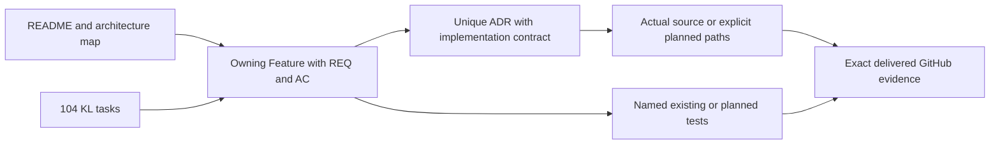

# Документація KeyLoad

KeyLoad поєднує документи, історію подій, надійну доставку, граф, часові ряди та пошук у спільному transaction/authorization/recovery середовищі. Почніть із [карти архітектури](Architecture.md); owning contracts нижче пояснюють поведінку конкретних функцій. [Продуктова специфікація](design/architecture-v0.3.uk.md) зберігає повний задум, але поточні [обов'язкові правила](../AGENTS.md) мають пріоритет над її старими DotNext/standalone-first choices.

## Функції продукту

| Canonical Feature | Що описує контракт |
|---|---|
| [DocumentStorage](Features/DocumentStorage.md) | JSON CRUD/PATCH/CAS, strict scalar/unique indexes, domain-bound atomic batch та persisted command outcomes |
| [EventStreams](Features/EventStreams.md) | Expected-revision append, generation/EventId dedup, ordered safe replay; planned aggregate snapshots/schema evolution |
| [Messaging](Features/Messaging.md) | Durable queues, scheduled/leased work, fenced ACK/NACK/renew, inbox, topics/groups/contiguous checkpoints; planned remote/recurring workflows |
| [GraphTraversal](Features/GraphTraversal.md) | Atomic edge/adjacency, visible directed bounded BFS; planned cross-partition/ranked graph operations |
| [TimeSeries](Features/TimeSeries.md) | UTC/sequence samples, idempotency, inclusive bounded ranges; planned retention/aggregates/rollups/chunks and isolated Timescale/ManagedCode comparison |
| [Search](Features/Search.md) | Exact vector та request-time lexical/hybrid search, policy/bounds; planned providers, ANN і global retrieval |
| [QueryExecution](Features/QueryExecution.md) | Bounded Q1 SQL, shared authorized AST, JSON/C# equivalence, Explain/cursors; planned extended/distributed operators |
| [Authorization](Features/Authorization.md) | Persisted identity/API-key verifiers, tenant/resource/row/field grants, PII omission/use rules, epochs і worker privacy |
| [ChangeFeeds](Features/ChangeFeeds.md) | Atomic outbox, protected resumable CDC, scalar snapshot+tail, projection checkpoints/pins/generation fencing |
| [BackupRestore](Features/BackupRestore.md) | Verified local backup/artifacts, clean-target restore, new identity/paused dispatch; planned full cluster-cut recovery |
| [BlobStorage](Features/BlobStorage.md) | Required chunked user blobs/partial reads; public/persisted protocol Proposed, implementation absent |

## Cluster, callers і delivery

| Canonical Feature | Що описує контракт |
|---|---|
| [ClusterReplication](Features/ClusterReplication.md) | Orleans RF3 durable protocol, quorum/read barriers, snapshots, minority denial та protected control capacity |
| [ClusterRouting](Features/ClusterRouting.md) | Distinct request grain, distributed directory/repartitioning, membership, atomic identity/physical placement і planned movement |
| [StorageRecovery](Features/StorageRecovery.md) | Node-local stores/journals/locks/apply/read lifetime, codec/checkpoints/corruption і process recovery |
| [ClientApi](Features/ClientApi.md) | Typed .NET/CLI transport і retries/errors; required official MCP/simple agent parity з Proposed mapping |
| [ResourceExecution](Features/ResourceExecution.md) | Bounded work/memory/lifetimes, multi-tenant admission/control reserve та honest metrics/telemetry |
| [BenchmarkComparisons](Features/BenchmarkComparisons.md) | Same-corpus correctness, Docker/Aspire native topologies, free-engine scope та graphs тільки з successful GitHub JSON |
| [CodeQuality](Features/CodeQuality.md) | Central SDK/style/Roslyn analysis, named-symbol/SOLID limits та retained diagnostics |
| [TestInfrastructure](Features/TestInfrastructure.md) | TUnit/MTP, actual process recovery і Docker RF3 .NET/MCP suites, versions/platforms та release gates |
| [RepositoryGovernance](Features/RepositoryGovernance.md) | MCAF policy preservation, local ownership, REQ/AC/ADR, bounded agent tasks і documentation coverage |

Рівно 20 owning Feature-специфікацій. Кожна містить requirements/acceptance, applicable ADRs, current/target slice map, positive/negative/edge/error flows та test/evidence boundaries. Frontend або інші N/A surfaces мають конкретну причину; required future capability не зникає з контракту через відсутність source.

## Рішення, джерела та стан

- [ADR index](ADR/README.md) описує рішення та їхню ідентичність. Accepted означає рішення/контракт; Implemented вимагає implementation/migration/tests/docs та verification evidence.
- [104-task tracker](implementation/status.json) є canonical джерелом implementation status; [coverage catalog](implementation/documentation-coverage.json) мапить кожну KL-задачу на Feature та ADR і не підміняє tracker.
- [Durability audit](implementation/durability-audit.md), [kernel qualification](implementation/kernel-qualification.json), [comparison contract](implementation/comparative-benchmarks.md) та [joined benchmark source review](implementation/benchmark-source-review.json) пояснюють конкретні докази й pending gates.
- Детальні existing designs: [Q1](design/query-q1.md), [admission](design/command-admission.md), [bounded reads](design/bounded-reads.md), [replica snapshots](design/replica-snapshots.md), [feeds](design/change-feeds.md). Feature/ADR links визначають owning acceptance; ці матеріали не оголошують майбутні протоколи готовими.

У code є базові data/auth/feed/backup можливості, але current shared source та Orleans/Docker/MCP міграція ще потребують delivered-source qualification. Public BlobStorage і official MCP/agent adapter contracts Proposed. [Історичний CI 36926803549](https://github.com/managedcode/KeyLoad/actions/runs/36926803549) на `9c570f8c33a7a9667507a8e1c0ca68860de3be45` не кваліфікує пізніші незакомічені зміни.

Product qualification і всі load/test results беруться лише з GitHub Actions; graphs — тільки з raw successful JSON із SHA/run/profile/topology/guarantees. Документальний/static review не доводить швидкість, power-loss durability, numeric coverage/complexity або production readiness. Метод цієї документаційної роботи: [ADR-037](ADR/ADR-037-documentation-coverage.md).
