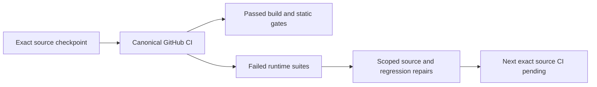

# Runtime qualification, 2026-10-02

## Main runtime baseline: 8b475d4

[Run37042082081](https://github.com/managedcode/KeyLoad/actions/runs/37042082081) retains all12 source-checked native reports. Full build, formatter, governance and118 analyzer cases pass on each OS. Units are805/805 on Linux/macOS and801/805 on Windows: four real comparison-host startup cases reach their unchanged20-second deadline. Recovery remains119/121 Linux/macOS and118/121 Windows. **Native Docker/Aspire RF3 passes36/36**, including real .NET/MCP SDK calls and Chrome administration. Comparison remains2/4 with measured profiles skipped. [Exact reports, failure identities, job URLs and artifact hashes](runtime-qualification-37042082081.json) are retained.

W4 source repairs optional-metadata absence and expected source/target file readiness, and adds safe restart failure receipts. [The source join](runtime-source-w4.json) records source hashes, preserved bounds, an all25-project development build with0warnings/0errors, full canonical formatter exit0 and static governance pass; its new136 recovery and41 RF3 case inventory is unexecuted until the delivered-SHA CI. Four Windows startup failures still need diagnostics to distinguish process exit wait from redirected-reader drain; no cause, timeout increase or configuration change is inferred. Coverage, actual activation movement, server-resource costs, endurance and power-loss gates remain open.

## Previous main runtime baseline: aed338c6

[Run37038422388](https://github.com/managedcode/KeyLoad/actions/runs/37038422388) completes with failed recovery, native restart and comparison gates. All three OSes pass full build, formatter, governance,118/118 analyzer cases and805/805 units. Recovery is119/121 Linux/macOS and118/121 Windows. **RF3 is35/36: all EventStreams SDK/MCP data assertions and the real Chrome admin browsing case pass.** The native node2 leader-loss/minority restart fails again. Comparison remains2/4, with measured profiles skipped. [Complete native hashes, failures, job URLs and archive metadata](runtime-qualification-37038422388.json) retain the exact source.

Recovery still fails absent checkpoint metadata stages7/8 on every OS and a target metadata-WAL reopen after snapshot publication on Windows. All20 parameterized50-trial seeded crash cases and all6 W3 readiness cases pass on every OS. The prior Windows source-store and elapsed-bound cases pass without a source repair; this does not establish stability or remove their W4 regression/fix obligations. No skipped native suite counts as passing.

Root W4 handles sanctioned metadata absence, all expected source/target ownership under one existing deadline, two isolated intrinsic timing measurements and additive safe failed-restart receipts. These source refinements require their own delivered-SHA CI. Both comparison predicates still fail with the runner in Waiting; retained TimeSeries/smoke reports remain unqualified. No local tests, recovery, AppHost or benchmarks ran.

## Previous main runtime baseline: 1bee2609

[Run37036628601](https://github.com/managedcode/KeyLoad/actions/runs/37036628601) completes with failed recovery, RF3 and comparison gates. The full solution build, formatter, governance, 118/118 analyzer cases and **805/805 unit cases pass on each of Linux, macOS and Windows**. Recovery is119/121 on Linux/macOS and116/121 on Windows; RF3 is32/36; comparison is2/4. All native suites ran with zero skipped cases. [Exact native report hashes, failures, job URLs and artifact receipts](runtime-qualification-37036628601.json) retain the complete source scope.

The prior admin unit, catalog cursor, discovery schema and native logging cases pass. RF3 still fails three EventStreams expected-data assertions and the real Chrome admin browse case; aed338c carries a later independent admin-owned source correction pending its own CI. Native leader-loss/minority passes this run, without a demonstrated root-cause repair or stability claim.

Recovery still fails both absent checkpoint metadata paths on every OS. Windows also fails source-store metadata/ownership reopening and the existing permanent-lock elapsed observation bound (6.9586565s versus the preserved6s bound). All twenty parameterized50-trial process-crash cases pass on every OS; five of six W3 readiness cases pass on Windows, and all six pass on Linux/macOS. Root W4 probes and real-file regressions remain source work pending exact GitHub qualification. Do not describe this as a green recovery gate.

Both native comparison completion predicates still fail with the runner in Waiting; retained smoke/TimeSeries reports remain unqualified and measured profiles were skipped. No local tests, recovery, AppHost or benchmarks ran.

## Previous main runtime baseline: b533c80

[Run37032546228](https://github.com/managedcode/KeyLoad/actions/runs/37032546228) completes with failed runtime gates. Full solution build, formatter, governance and118/118 analyzer cases pass on Ubuntu, macOS and Windows. Unit suites are800/804 on each OS; recovery is119/121 on Linux/macOS and118/121 on Windows; Docker/Aspire RF3 is27/36 and comparison2/4, with no skipped native cases. [The exact native reports, case identities, SHA-256 hashes, jobs and artifact receipts](runtime-qualification-37032546228.json) preserve the complete scope.

The W3 search-byte and exact raw-read-budget cases pass across all three OSes. Official MCP initialization succeeds and thirteen of the prior seventeen failing MCP cases now pass; the other four reach existing catalog or event-byte assertions. Six real-file readiness cases and all twenty parameterized seeded process-crash cases pass on every OS. The complete recovery gate still fails: checkpoint stages7/8 have no live tree/0.meta.wal, and a separate Windows replica-snapshot caller still reopens before the WAL becomes available. Native diagnostic capture still misses ToolsCall; the two new admin unit cases and one catalog cursor argument also fail on every OS. Each failure remains in the task plan; none is reclassified as passing.

The RF3 failures are one discovery-schema assertion, three event-byte assertions, three admin authorization/shell cases, the admin browser case and one native node2 restart. Concurrent admin work owns its source and associated catalog/assertion corrections. Root investigates recovery and native restart separately. The two comparison completion predicates still fail with the runner in Waiting; preserved smoke/TimeSeries JSON remains unqualified and measured profiles were skipped. No local tests, recovery, AppHost or benchmarks ran.

## Main build baseline:49a5b605

[Run37029344985](https://github.com/managedcode/KeyLoad/actions/runs/37029344985) completed failed at the matrix/RF3/comparison build gates after the all-source main checkpoint. The standalone analyzer suite passes; unit, process-recovery, RF3 and comparison suites were not executed. [Native reports, compiler diagnostics and artifact receipts](runtime-qualification-37029344985.json) retain the exact source and job scope. This does not supersede the prior full runtime evidence below.

The joined correction preserves the admin dashboard clock/comparison/async policy and adds the real metadata-WAL readiness probe under [REQ/AC-STORAGE-012](../Features/StorageRecovery.md). Six real-file cases cover all three holder paths, cancellation, pre-cancellation and the unchanged five-second permanent-lock bound. Every original recovery caller,50 trials and15-second deadline remains. [The tests-first source receipt](recovery-readiness-w3.json) records the hashes and source join. All25 projects compile with0warnings/0errors in a development build; full corrected-source GitHub qualification remains pending.

## Previous completed candidate: fa80c701

[Run37021991878](https://github.com/managedcode/KeyLoad/actions/runs/37021991878) completed with required failures. Full solution build/format/governance and118/118 analyzer regressions pass on all three OSes. Unit suites are787/788 each; all four prior W2 failures now pass. Ubuntu search stored bytes, macOS exact topic-read bytes and Windows concurrent native logging capture fail independently. [Complete native reports, hashes, jobs and archive receipts](runtime-qualification-37021991878.json) retain precise cases. The historical53-case ledger now has52 exact cases passing on all OSes and one corrected fixture method with all current cases passing; the retired argument is not claimed executed.

Recovery executes after every successful build even if unit tests fail:115/115 on Linux/macOS and104/115 on Windows. Eleven Windows errors involve metadata-WAL sharing or per-trial cancellation. The readiness probe omits that WAL; the holder is unknown. Preserve all seeds, deadlines and assertions, and do not claim a product/dependency cause without evidence.

RF3 is12/29: nine of26 caller cases and three separate real-file receipt cases pass. The retained-replica scenario passes this run without a demonstrated root-cause repair and still needs stability proof. Seventeen official MCP cases receive discovery -32603 then fallback Initialize HTTP400 at ProtocolRevisionCount. Pinned SDK/.NET source uses unknown-length content; maximum-capacity buffering projects at least240,947,200 bytes into the134,217,728-byte default control pool. Bounded actual-capacity framing repairs are source joined, pending renewed official RF3 proof. Guards, auth, quotas, protocol and pool defaults remain exact.

Comparison is2/4. Existing report bytes now survive cleanup: unqualified schema3 smoke and separate TimeSeries reports are retained. TimeSeries records20 successful attempts and20 checks total across its three targets and48 samples. Native terminal/zero-exit gates fail and foreign-schema assertion is not reached. Report existence does not qualify performance or refresh the published website; Aspire13.6 native watch remains an external blocker.

The new main source packet repairs recorded-time fixture coordination, same-store raw-byte boundaries, native logging scheduling and unknown-length MCP buffers. Its exact-SHA CI remains pending. No local tests, recovery or benchmarks ran.

## Historical candidate ad594642

Previous completed canonical workflow: [run37015193756](https://github.com/managedcode/KeyLoad/actions/runs/37015193756), source ad594642b4f1a05ac5df0fff0a33b562f4aebf87, branch codex/runtime-qualification-20261002. It completed with **failure**. Subsequent W2 repairs are source-reviewed and development-built, awaiting the next exact-SHA GitHub run. Shared checkout HEAD/index and independent website changes remain preserved.

## Previous gates at ad594642

| Gate | Result | Exact job |
|---|---|---|
| Standalone analyzer regressions |88 passed,0 failed,0 skipped|[analyzer](https://github.com/managedcode/KeyLoad/actions/runs/37015193756/job/110864228210)|
| Ubuntu full build/format/governance/analyzers | Passed; unit778 passed/3 failed/0 skipped, total781 |[Ubuntu](https://github.com/managedcode/KeyLoad/actions/runs/37015193756/job/110864228200)|
| macOS full build/format/governance/analyzers | Passed; unit777 passed/4 failed/0 skipped, total781 |[macOS](https://github.com/managedcode/KeyLoad/actions/runs/37015193756/job/110864228540)|
| Windows full build/format/governance/analyzers | Passed; unit779 passed/2 failed/0 skipped, total781 |[Windows](https://github.com/managedcode/KeyLoad/actions/runs/37015193756/job/110864228224)|
| Process recovery | Not run after unit failure on all OSes | Same matrix jobs |
| Docker/Aspire RF3 real SDKs |8 passed/18 failed/0 skipped, total26 |[RF3](https://github.com/managedcode/KeyLoad/actions/runs/37015193756/job/110864228001)|
| Comparison suite |2 passed/2 failed/0 skipped; later measured profiles not run |[comparison](https://github.com/managedcode/KeyLoad/actions/runs/37015193756/job/110864228402)|

Counts qualify only the recorded source and scope. Five vector finite/golden/real-store tests pass on every native OS run; no software-fallback invocation or new SIMD validation optimization is qualified. All12 artifacts were downloaded; actual report hashes and GitHub archive metadata are in [the complete receipt](runtime-qualification-37015193756.json). Extracted-report hashes are verified; raw downloaded ZIP digests were not verified. No local tests, recovery, AppHost or load qualification ran.

## Remaining failures and W2 source packets

| Test / gate | Actual failure at ad594642 | Accepted next source / evidence |
|---|---|---|
|MissingAndMalformedStoredBodiesStillRejectThenRecover, all OSes|Atomic missing-body Corruption propagates; fixture expected a result|Exact exception and unchanged index/body/counters/position/apply assertions|
|SingleMessageReceiveStopsAtFirstReadyRecordAndKeepsFifo, all OSes|One delivery scans257 index entries|VisitRange stops after enough deliveries or256 examined records; no mutation during callback; expiry/FIFO/cap regressions|
|CancellationWhileJsonIsGrowingStopsBeforeRawCsvIsPublished, Ubuntu/macOS|Observer misses early cutoff or whole-write cancellation|Arm actual dedicated-thread file observer before writing; preserve20k×4096 corpus,10s,OCE,<quarter cutoff,no MD/CSV; observe all cleanup tasks|
|MidBodyCancellationMapsReadFailureAndClientCanSendNextRequest, macOS|Actual server RequestAborted wait times out|One bounded second incomplete chunk after cancelled caller result; same5s and actual abort/client reuse; closed stage evidence|
|Seventeen official MCP cases|Discovery/initialize still fails HTTP400; recorded legacy initialize is a secondary fallback|Keep current protocol/authority, add closed stage/method diagnostics to distinguish first discovery rejection|
|Retained replica restart scenario|Write while one replica is stopped maps an unexpected exception to RecoveryRequired|Keep first bounded RF3 failure file before later failures overwrite it; root cause still open|
|Two native comparison completion gates|Runner state remains Waiting with unavailable creation/start/exit timestamps|Pinned Aspire13.6 executable watch terminates after a Polly watch-response timeout; unpublished upstream fix remains external qualification blocker|

TimeSeries partial report contains20 successful attempts and20 matching correctness checks across TimescaleDB2.30.2-pg18, RF3 KeyLoad and published ManagedCode.TimeSeries10.0.0 in-memory buckets. They exercise48 samples, range/boundary/offset/empty/invalid handling, aggregation and cleanup. The whole TimeSeries test failed its native completion gate and did not reach the separate foreign-schema assertion; report existence does not make that test pass. No matched durability or performance winner is claimed.

Official Aspire source at13.6.0 awaits the watch response under a one-minute timeout. [Upstream fix f48a7b1](https://github.com/microsoft/aspire/commit/f48a7b1251d339b21856497f10b36d227a5e57cc) retries that timeout; no compatible published patch was available in the feed read. Keep native terminal/zero-exit checks. Preserve existing report bytes after app stop, and run recovery independently after a successful build without ignoring unit failure.

## Historical baseline

[Run37005805424](https://github.com/managedcode/KeyLoad/actions/runs/37005805424) at6949fa0 previously failed51/53/50 of770 unit cases,20 of26 RF3 cases and2 of4 comparison cases. At ad594642,48 of those exact unit cases pass on all OSes and one corrected catalog fixture method passes all current cases. Four distinct cases remain; the retired catalog argument is not reported as executed. [The full53-case attribution and new per-OS proof](runtime-unit-repairs-37005805424.json) retain the original symptoms.

## Scope and evidence

Tombstone/null-versus-empty regressions, strict frame decoding, malformed bounded HTTP problems, retained quota corruption and matching stream command IDs now have actual multi-OS unit proof. Per-request fixture isolation and leader-loss recovery pass in RF3; official MCP, retained replica recovery and native comparison completion still fail. Root TestResults retention works, including complete analyzer/RF3/comparison reports. Progressive report byte/schema tests pass; its real early-cancellation gate remains open. W2 source packets require renewed full CI.

## Unit and artifact traceability

The [complete run receipt](runtime-qualification-37015193756.json) retains native summaries, the four-case union, every exact job, all12 GitHub archive receipts and downloaded report hashes. The [historical repair ledger](runtime-unit-repairs-37005805424.json) maps each prior case to its actual new proof or remaining failure. Production readiness, coverage, software fallback, server-resource budgets, activation movement, fault/endurance and power-loss gates remain open.
