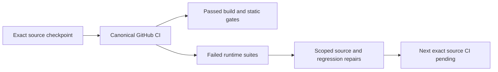

# Runtime qualification, 2026-10-02

Canonical workflow: [run 37005805424](https://github.com/managedcode/KeyLoad/actions/runs/37005805424), source `6949fa0c3099443c6f34f91245ab8064ef22c63c`, branch `codex/runtime-qualification-20261002`. The workflow completed with **failure**. Its source checkpoint preserved the shared main checkout and index. The repairs described below are subsequent working-tree changes awaiting another exact-SHA run.

## Actual gates

| Gate | Result | Exact job |
|---|---|---|
| Standalone analyzer regressions | 88 passed, 0 failed, 0 skipped | [analyzer-rules](https://github.com/managedcode/KeyLoad/actions/runs/37005805424/job/110833669158) |
| Ubuntu build, formatter, governance and analyzer regressions | Passed; unit 719 passed / 51 failed / 0 skipped, total 770 | [verify Ubuntu](https://github.com/managedcode/KeyLoad/actions/runs/37005805424/job/110833669575) |
| macOS build, formatter, governance and analyzer regressions | Passed; unit 717 passed / 53 failed / 0 skipped, total 770 | [verify macOS](https://github.com/managedcode/KeyLoad/actions/runs/37005805424/job/110833669398) |
| Windows build, formatter, governance and analyzer regressions | Passed; unit 720 passed / 50 failed / 0 skipped, total 770 | [verify Windows](https://github.com/managedcode/KeyLoad/actions/runs/37005805424/job/110833669335) |
| Process recovery | Not run on any OS after the unit step failed | Same matrix jobs |
| Docker/Aspire RF3, real .NET and official MCP SDKs | 6 passed / 20 failed / 0 skipped, total 26 | [docker-rf3](https://github.com/managedcode/KeyLoad/actions/runs/37005805424/job/110833669299) |
| Real comparison suite | 2 passed / 2 failed; measured profiles not run | [comparison-smoke](https://github.com/managedcode/KeyLoad/actions/runs/37005805424/job/110833669362) |

All counts describe that SHA. A passed matrix build or analyzer suite does not qualify the later repairs, the whole runtime, activation movement, resource budgets, performance or power-loss durability. No local tests, recovery qualifications, AppHost runs or load benchmarks were executed.

## Repair ownership and remaining proof

- StorageRecovery/ADR-041: preserve a null transaction value as a tombstone instead of a live empty ReadOnlyMemory value. Real-store tests cover empty versus absent bytes, journal/snapshot reopen and exact frame limits. Deletion-related downstream failures are expected fallout, awaiting CI verification.
- ClientApi/ADR-035 and ADR-039: safe malformed problem-body fallback, validated MCP root-property decoding, official SDK default protocol negotiation and real Kestrel cancellation coordination. Frozen catalog fixtures reflect all 47 tools while retaining exact paging byte limits and persisted authority.
- EventStreams, ResourceExecution, BlobStorage and ClusterRouting: preserve matching envelope/payload IDs, coordinate admission with a real exclusive store gate, supply the existing row-owner access during upload setup and isolate the request-ID scenario's persisted catalog identity. No product authority or resource-migration validation is weakened.
- BenchmarkComparisons/ADR-050: retain the pinned Timescale repository/digest and assert Aspire's native image representation. That test failed before database startup; this run proves no Timescale workload. The separate comparison runner remained Waiting without process creation after all recorded dependency gates completed; the cause remains open.
- ResourceExecution/ADR-035: private progressive report write views address synchronous immutable-converter buffering. Exact schema/metadata and early real-file cancellation must pass before qualification. No peak-allocation or speed claim follows from the source change.
- TestInfrastructure/ADR-036: retain root TestResults in addition to scoped report paths and add a separate comparison-test-results archive. The measured comparison-suite contract remains unchanged. New archive contents require verification in the next run.

## Unit failure ledger

[Source repair attribution for all 53 cases](runtime-unit-repairs-37005805424.json) records confirmed fixes and explicit cause inferences separately. The union contains 53 distinct failing cases across the three OSes. Every row stays open until its caller-visible scenario passes at the repaired SHA. The platform-only cancellation failures are retained; a source-cause inference is not a passing test.

| Test | Platforms | Observed symptom | State |
|---|---|---|---|
| AcAuth002MissingProtectedPrincipalAtExistingCutRequiresRecovery | ubuntu, macos, windows | JsonException: The input does not contain any JSON tokens. Expected the input to start with a valid JSON token, when isFinalBlock is true. Path: $ \| LineNumber: 0 \| BytePositionInLine: 0. | Pending exact repaired-SHA verification |
| AcBlob003CurrentPrincipalRowAndCreatorAuthorityAreRecheckedForEveryRead | ubuntu, macos, windows | KeyLoadException: The principal cannot write this row scope. | Pending exact repaired-SHA verification |
| AcBlob007MissingCurrentStateFailsEveryOperationWithoutEffects | ubuntu, macos, windows | AssertionException: Expected to be null | Pending exact repaired-SHA verification |
| AcBlob005MissingPersistedResourceQuotaAfterReopenFailsClosed | ubuntu, macos, windows | AssertionException: Expected exactly KeyLoadException but got AssertionException: Expected exactly KeyLoadException but no exception was thrown | Pending exact repaired-SHA verification |
| AcBlob004ReusedUploadIdCannotReplayAnotherLifetimeOutcome | ubuntu, macos, windows | KeyLoadException: The persisted blob records are inconsistent. | Pending exact repaired-SHA verification |
| AcBlob003UploadStateAuthoritySurvivesHeadOwnerChangeButHeadMutationsDoNot | ubuntu, macos, windows | AssertionException: Expected to be null | Pending exact repaired-SHA verification |
| AcBlob005ExpiredUploadReclaimReleasesUnusedReservationExactlyOnce | ubuntu, macos, windows | KeyLoadException: The persisted blob records are inconsistent. | Pending exact repaired-SHA verification |
| AcBlob004DeleteRetiresCurrentVersionBeforeBoundedReclaimAndFinalReceiptReplay | ubuntu, macos, windows | KeyLoadException: The persisted blob records are inconsistent. | Pending exact repaired-SHA verification |
| AcBlob004RestoreRebindsAuthorityAndPreservesPublishedBytesAndActivePartForReclaim | ubuntu, macos, windows | KeyLoadException: The persisted blob records are inconsistent. | Pending exact repaired-SHA verification |
| MissingAndWrongSequencePointsCannotPartiallyPurge | ubuntu, macos, windows | AssertionException: Expected exactly KeyLoadException but got AssertionException: Expected exactly KeyLoadException but no exception was thrown | Pending exact repaired-SHA verification |
| NativePagesTraverseTheCompleteCatalogExactlyOnce | ubuntu, macos, windows | AssertionException: Expected to be 37 | Pending exact repaired-SHA verification |
| InvalidHeaderUsesFixedSafeValidation(EmptyNameValues) | ubuntu, macos, windows | AssertionException: Expected exactly KeyLoadException but got AssertionException: Expected exactly KeyLoadException but no exception was thrown | Pending exact repaired-SHA verification |
| InvalidHeaderUsesFixedSafeValidation(EmptySession) | ubuntu, macos, windows | AssertionException: Expected exactly KeyLoadException but got AssertionException: Expected exactly KeyLoadException but no exception was thrown | Pending exact repaired-SHA verification |
| InvalidHeaderUsesFixedSafeValidation(EmptyMethodValues) | ubuntu, macos, windows | AssertionException: Expected exactly KeyLoadException but got AssertionException: Expected exactly KeyLoadException but no exception was thrown | Pending exact repaired-SHA verification |
| InvalidHeaderUsesFixedSafeValidation(EmptyLastEvent) | ubuntu, macos, windows | AssertionException: Expected exactly KeyLoadException but got AssertionException: Expected exactly KeyLoadException but no exception was thrown | Pending exact repaired-SHA verification |
| CanonicalCursorResumesAtExactIndex(36) | ubuntu, macos, windows | KeyLoadException: A catalog tool exceeds the MCP discovery page budget. | Pending exact repaired-SHA verification |
| AcBlob004NormalizationReopensAcrossMoreThanOneStateAndHeadPage | ubuntu, macos, windows | KeyLoadException: The persisted blob records are inconsistent. | Pending exact repaired-SHA verification |
| NativePageMutationCannotAlterLaterDiscovery | ubuntu, macos, windows | ArgumentException: The specified document is not a valid MCP tool input JSON schema. (Parameter 'InputSchema') | Pending exact repaired-SHA verification |
| MalformedCursorUsesOneFixedSafeValidation(keyload-mcp-v1:37) | ubuntu, macos, windows | AssertionException: Expected exactly KeyLoadException but got AssertionException: Expected exactly KeyLoadException but no exception was thrown | Pending exact repaired-SHA verification |
| EscapedUnpairedSurrogatesUseSafeValidation({"\uD800":0}) | ubuntu, macos, windows | AssertionException: Expected exactly KeyLoadException but got InvalidOperationException: Cannot read incomplete UTF-16 JSON text as string with missing low surrogate. | Pending exact repaired-SHA verification |
| EscapedUnpairedSurrogatesUseSafeValidation({"\uDC00":0}) | ubuntu, macos, windows | AssertionException: Expected exactly KeyLoadException but got InvalidOperationException: Cannot read invalid UTF-16 JSON text as string. Invalid surrogate value: '0xDC00'. | Pending exact repaired-SHA verification |
| ErrorBodiesArePreservedWhenValidAndBoundedWhenNullMalformedOrOversized | ubuntu, macos, windows | AssertionException: Expected to be equal to "The server response is unavailable." | Pending exact repaired-SHA verification |
| AcMp005RangePreservesRevisionOrderCutAndLookahead | ubuntu, macos, windows | KeyLoadException: The envelope and command IDs differ. | Pending exact repaired-SHA verification |
| AcMp005GenerationAndRetentionFailuresRemainCallerVisible | ubuntu, macos, windows | KeyLoadException: The envelope and command IDs differ. | Pending exact repaired-SHA verification |
| AcMp005RangeWorkStopsBeforeTheNextEventAndAHealthyReadStillWorks | ubuntu, macos, windows | KeyLoadException: The envelope and command IDs differ. | Pending exact repaired-SHA verification |
| AcMp005PersistedFieldPoliciesRedactPayloadAndHeaders | ubuntu, macos, windows | KeyLoadException: The envelope and command IDs differ. | Pending exact repaired-SHA verification |
| AcMp005CompletePageMetadataCountsTowardTheResultLimit | ubuntu, macos, windows | KeyLoadException: The envelope and command IDs differ. | Pending exact repaired-SHA verification |
| AcMp005CallerCancellationDoesNotPoisonTheFollowingRead | ubuntu, macos, windows | KeyLoadException: The envelope and command IDs differ. | Pending exact repaired-SHA verification |
| AcMp006_MissingAndMalformedStoredBodiesStillRejectThenRecover | ubuntu, macos, windows | AssertionException: Expected to be equal to Corruption | Pending exact repaired-SHA verification |
| ExpiredWorkerCannotAckAfterReclaimAndAttemptsReachDeadLetter | ubuntu, macos, windows | KeyLoadException: The operation contains invalid protocol JSON. | Pending exact repaired-SHA verification |
| InboxEffectsAndAckAreAtomicAndReplayCannotApplyDifferentEffects | ubuntu, macos, windows | JsonException: The input does not contain any JSON tokens. Expected the input to start with a valid JSON token, when isFinalBlock is true. Path: $ \| LineNumber: 0 \| BytePositionInLine: 0. | Pending exact repaired-SHA verification |
| ProcessingReleasesInputQuotaAtomicallyAndFailureRestoresItsLease | ubuntu, macos, windows | JsonException: The input does not contain any JSON tokens. Expected the input to start with a valid JSON token, when isFinalBlock is true. Path: $ \| LineNumber: 0 \| BytePositionInLine: 0. | Pending exact repaired-SHA verification |
| AcMp006_RenewForeignExpiredAndStaleTokensPreserveLeaseFencing | ubuntu, macos, windows | KeyLoadException: The operation contains invalid protocol JSON. | Pending exact repaired-SHA verification |
| AcMp006_ProcessingReusesLeaseAndReleasesQuotaBeforeEffects | ubuntu, macos, windows | JsonException: The input does not contain any JSON tokens. Expected the input to start with a valid JSON token, when isFinalBlock is true. Path: $ \| LineNumber: 0 \| BytePositionInLine: 0. | Pending exact repaired-SHA verification |
| AcMp005MissingOrCorruptTopicRecordsFailAndRestoredRecordReads | ubuntu, macos, windows | AssertionException: Expected to be equal to HistoryUnavailable | Pending exact repaired-SHA verification |
| AcMp006SingleMessageReceiveStopsAtFirstReadyRecordAndKeepsFifo | ubuntu, macos, windows | KeyLoadException: The operation contains invalid protocol JSON. | Pending exact repaired-SHA verification |
| RetainedEventIdRejectsDifferentContentAndPreservesDedupForTheInitialStoreFormat | ubuntu, macos, windows | AssertionException: Expected to be equal to DuplicateEventId | Pending exact repaired-SHA verification |
| ProcessingEffectsAndAcknowledgementRollBackTogetherAndInboxSurvivesReplay | ubuntu, macos, windows | KeyLoadException: The operation contains invalid protocol JSON. | Pending exact repaired-SHA verification |
| ExactSerializedEventQuotaAcceptsOrderedBatchAndOneByteShortRollsBack | ubuntu, macos, windows | AssertionException: Expected to be equal to 1050 | Pending exact repaired-SHA verification |
| AcMp006TextAndBytePathsPreserveLiteralEscapeAndSurrogateReplacement | ubuntu, macos, windows | AssertionException: Expected exactly InvalidOperationException but got JsonException: The JSON value could not be converted to System.String. Path: $ \| LineNumber: 0 \| BytePositionInLine: 8. | Pending exact repaired-SHA verification |
| AcMp006MultiSubscriptionReplayRetainsDeliveryIdentityAndLeaseFencing | ubuntu, macos, windows | AssertionException: Expected to be equal to StaleLease | Pending exact repaired-SHA verification |
| MissingProtectedPrincipalInVerifiedPendingImageRejectsHostAndSafeRetry | ubuntu, macos, windows | JsonException: The input does not contain any JSON tokens. Expected the input to start with a valid JSON token, when isFinalBlock is true. Path: $ \| LineNumber: 0 \| BytePositionInLine: 0. | Pending exact repaired-SHA verification |
| AcPsw002RepeatedValidationReplacementDeletionResetAndCallerBuffersKeepFinalFrame | ubuntu, macos, windows | AssertionException: Expected to be equivalent to [75, 76, 68, 87, 65, 76, 49, 0, 59, 0, 0, 0, 1, 0, 0, 0, 0, 0, 0, 0, 125, 139, 34, 82, 162, 214, 152, 205, 86, 5, 218, 5, 208, 82, 44, 4, 184, 59, 211, 74, 84, 2, 225, 35, 230, 73, 146, 194, 172, 100, 183, 232, 91, 123, 34, 107, 101, 121, 34, 58, 34, 77, 65, 61, 61, 34, 44, 34, 118, 97, 108, 117, 101, 34, 58, 34, 81, 69, 70, 67, 34, 125, 44, 123, 34, 107, 101, 121, 34, 58, 34, 85, 65, 61, 61, 34, 44, 34, 118, 97, 108, 117, 101, 34, 58, 110, 117, 108, 108, 125, 93] | Pending exact repaired-SHA verification |
| IncrementalFrameAccountingMatchesCanonicalJsonAtExactBase64Boundaries | ubuntu, macos, windows | AssertionException: Expected to be equivalent to [75, 76, 68, 87, 65, 76, 49, 0, 63, 0, 0, 0, 1, 0, 0, 0, 0, 0, 0, 0, 35, 54, 119, 216, 83, 233, 175, 224, 195, 139, 183, 193, 223, 21, 96, 79, 251, 25, 143, 132, 137, 79, 85, 137, 9, 18, 100, 62, 38, 122, 223, 176, 91, 123, 34, 107, 101, 121, 34, 58, 34, 43, 47, 56, 61, 34, 44, 34, 118, 97, 108, 117, 101, 34, 58, 34, 82, 50, 121, 82, 116, 116, 115, 61, 34, 125, 44, 123, 34, 107, 101, 121, 34, 58, 34, 47, 47, 115, 61, 34, 44, 34, 118, 97, 108, 117, 101, 34, 58, 110, 117, 108, 108, 125, 93] | Pending exact repaired-SHA verification |
| AcMp011StagedReplacementTombstoneAndFallbackCountEachLookupOnce | ubuntu, macos, windows | AssertionException: Expected to be null | Pending exact repaired-SHA verification |
| AcCq001_TypedRecordsRoundTripThroughTheActualStorageGate | ubuntu, macos, windows | JsonException: The input does not contain any JSON tokens. Expected the input to start with a valid JSON token, when isFinalBlock is true. Path: $ \| LineNumber: 0 \| BytePositionInLine: 0. | Pending exact repaired-SHA verification |
| AcMp002TransactionMergeChargesOverridesAndIgnoresOutOfRangeChanges | ubuntu, macos, windows | AssertionException: Expected to be 3 | Pending exact repaired-SHA verification |
| FreshRequestActorsKeepOneStableWriteOutcomeAndRejectWrongPartition | ubuntu, macos, windows | AssertionException: Expected to be equal to [123, 34, 99, 111, 109, 109, 97, 110, 100, 73, and 339 more...] | Pending exact repaired-SHA verification |
| AcMp004_RealStoreWaitSharesOneAdmissionAcrossAllAnalyticalEntries | ubuntu, macos, windows | AggregateException: Analytical admission cleanup failed. (The operation has timed out.) | Pending exact repaired-SHA verification |
| AcMp012_InFlightCancellationAtRealStoreGateReleasesAdmission | ubuntu, macos | AggregateException: Analytical admission cleanup failed. (Expected to be true | Pending exact repaired-SHA verification |
| AcEm002RealFixtureSetupRunsOperationsAndCleansStoreIdempotently | ubuntu, macos, windows | AssertionException: Expected to be equal to "{"text":"clustered document database","number":42}" | Pending exact repaired-SHA verification |
| CancellationWhileJsonIsGrowingStopsBeforeRawCsvIsPublished | macos | AssertionException: Expected to be true | Pending exact repaired-SHA verification |
| MidBodyCancellationMapsReadFailureAndClientCanSendNextRequest | macos | TimeoutException: The operation has timed out. | Pending exact repaired-SHA verification |

## Artifact receipts

Metadata below was obtained from the GitHub Actions artifact API for this exact run and SHA. Digests are GitHub-reported archive digests, not independently recomputed ZIP hashes. Artifacts were downloaded for inspection under /private/tmp/keyload-runtime-ci-37005805424/. The original RF3/analyzer/comparison retention globs omitted some root-level reports; absence of a retained report is not a pass.

| Archive | ID | Bytes | GitHub digest |
|---|---|---:|---|
| [comparison-suite](https://github.com/managedcode/KeyLoad/actions/runs/37005805424/artifacts/11226206127) | 11226206127 | 879 | `sha256:fb40cfd0baae393fb86d13dbea4a0bf3c258b74f690d175c966a6a835d0520ac` |
| [code-quality-comparisons](https://github.com/managedcode/KeyLoad/actions/runs/37005805424/artifacts/11226047032) | 11226047032 | 675788 | `sha256:abac9f0439d7493db8325ce6a78b704d7eeceb354888c673a155166750dd71a6` |
| [test-results-macos-latest](https://github.com/managedcode/KeyLoad/actions/runs/37005805424/artifacts/11226031171) | 11226031171 | 621010 | `sha256:ce72965e46d646c2b08b3a21dfdc1eed2be89ffc94da94b1538226bb1d6c39ab` |
| [code-quality-macos-latest](https://github.com/managedcode/KeyLoad/actions/runs/37005805424/artifacts/11226016382) | 11226016382 | 1285825 | `sha256:bf8f5520b7ff01a2589e90829826c6bf1e0ee2e083c7cd2a86e87d2d16cc7252` |
| [test-results-ubuntu-latest](https://github.com/managedcode/KeyLoad/actions/runs/37005805424/artifacts/11225792689) | 11225792689 | 625717 | `sha256:f8ae4b231aedcc6482f3cb04fadb88569a3548c548d07e5d13d8f9c340180f66` |
| [analyzer-rule-evidence](https://github.com/managedcode/KeyLoad/actions/runs/37005805424/artifacts/11225717154) | 11225717154 | 101591 | `sha256:cdc00a8adf22b954660e63cad706ccab315777a1a00f49c88963c4fa7885ff1d` |
| [code-quality-ubuntu-latest](https://github.com/managedcode/KeyLoad/actions/runs/37005805424/artifacts/11225703118) | 11225703118 | 1291421 | `sha256:4eb01a729d86cbf27af14631bb2793833ef1647e26813a24a11290372c7e6e53` |
| [code-quality-windows-latest](https://github.com/managedcode/KeyLoad/actions/runs/37005805424/artifacts/11225134743) | 11225134743 | 1292866 | `sha256:1dd0e321748c03e3df9aa2c662fe5e3b9eb522e272fc89a81f2988fdc7304ccf` |
| [test-results-windows-latest](https://github.com/managedcode/KeyLoad/actions/runs/37005805424/artifacts/11225134741) | 11225134741 | 627516 | `sha256:21991d831df87de7f3217131c1ab0b73c943b275154e32159b9344dce9257390` |
| [docker-rf3-qualification](https://github.com/managedcode/KeyLoad/actions/runs/37005805424/artifacts/11224979295) | 11224979295 | 3491 | `sha256:128a3a64970a0abe34ecb53ac3b52c09cb2b153e0ff373e19f23a11f43850f70` |
| [code-quality-docker-rf3](https://github.com/managedcode/KeyLoad/actions/runs/37005805424/artifacts/11224754576) | 11224754576 | 674530 | `sha256:6631a3d6c2c965ef445c26af1aa37568c93bb9b195c6ffe8f10c46f7e5c5569c` |

## Subsequent joined development checks

All25 current shared-checkout projects passed enabled Release compilation with 0 warnings/errors after the runtime packets joined. The build used -m:1 -nr:false -p:UseSharedCompilation=false after an initial build stalled; no analyzer or warning policy was disabled. Build log SHA256: `b239d7cfef1813630b2a5135a739a8f31032976f4ddfb7a66f7bd30d0325606d`. Canonical `dotnet format KeyLoad.slnx --verify-no-changes --no-restore`, static governance and whitespace checks passed. These checks include concurrent website source in the shared dirty checkout and do not qualify a committed candidate or runtime. The next canonical GitHub run must compile and execute its exact candidate tree.

Test-first source receipts: report streaming `74912c8ff1b45f33469b3b51bf19ce69c7627558db74888eef4a8658f3cd2089`, quota fixture before correction `b742a9dbe209de094f87f89686ee8040683726bca6d0e796fa257bec6b1f4be3`. Scope reviews found no additional report schema/task-lifetime issue; progressive output, real transport behavior and performance remain subject to actual CI.
